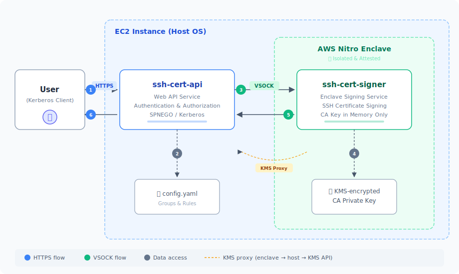

# **Cerberus: An AWS Nitro Enclave SSH Certificate Authority**

[![CI][ci-badge]][ci] [![Go Report Card][go-reportcard-badge]][go-reportcard] [![Go Reference][pkg.go.dev-badge]][pkg.go.dev]

Cerberus is a highly secure, automated SSH Certificate Authority (CA) built to run on AWS. It leverages AWS Nitro Enclaves to ensure that the CA's private signing key is never exposed to the host operating system, network, or any user. It provides a web API for users to request signed SSH certificates after authenticating with Kerberos.

## **Features**

- **Ultimate Key Security**: The CA private key is loaded directly into a secure Nitro Enclave and never leaves it. It is not accessible from the parent EC2 instance.
- **Kerberos Authentication**: The public-facing API uses Kerberos (SPNEGO) to authenticate users, integrating seamlessly with existing enterprise identity systems like Active Directory or MIT Kerberos.
- **Flexible, Group-Based Authorization**: A simple, powerful YAML file (config.yaml) defines which users belong to which groups and what permissions each group has (e.g., certificate validity, allowed server principals). Authorization is enforced by [Casbin](https://casbin.org/) with per-group policy evaluation and wildcard principal support.
- **Secure Communication**: The API server communicates with the signing service in the enclave over a secure, isolated VSOCK connection, not the standard network stack.
- **Auditable**: Every signing request is logged with the authenticated principal and group; certificates can carry operator-defined custom metadata (e.g. `team@example.com`, `access-level@example.com`) for downstream audit and policy use. The principal itself is recorded as the cert's `KeyId`, and `ValidAfter`/`ValidBefore` bound the issuance window in the signed cert.
- **Easy to Deploy**: Makefile automation simplifies building the application binaries and the Enclave Image File (.eif).

## **Architecture**

The system is composed of two primary services that work together to provide a secure signing workflow.

<p align="center">
  
</p>

1. A user with a valid Kerberos ticket makes an HTTPS request to the ssh-cert-api service with the public key they want signed.
2. The ssh-cert-api service authenticates the user's Kerberos ticket and authorizes the request using Casbin policy evaluation against the user's group membership defined in config.yaml.
3. If authorized, the API service forwards a detailed signing request to the ssh-cert-signer service running in the Nitro Enclave via a secure VSOCK.
4. The ssh-cert-signer service fetches the CA private key from AWS KMS-encrypted storage.
5. The enclave service signs the certificate and returns it to the API service over the VSOCK.
6. The ssh-cert-api service sends the signed certificate back to the user.

## **Project Structure**

```
cerberus/
├── constants/                    # Shared constants
├── logging/                      # Logging component
├── messages/                     # Shared message types
├── packaging/rpm/                # RPM spec, systemd units, build script
├── docs/                         # RUNBOOK, cssh howto, KMS attestation policy
├── ssh-cert-api/                 # API service
│   ├── cmd/ssh-cert-api/         # Main entry point
│   ├── internal/                 # Private application code
│   │   ├── api/                  # HTTP server and handlers
│   │   ├── auth/                 # Kerberos authentication
│   │   ├── authz/                # Casbin-based authorization
│   │   ├── config/               # Configuration management
│   │   ├── enclave/              # Enclave communication
│   │   └── proxy/                # VSOCK proxy
│   └── configs/                  # Configuration files
└── ssh-cert-signer/              # Enclave service
    ├── cmd/ssh-cert-signer/      # Main entry point (VSOCK accept loop, signer)
    └── internal/                 # Private application code
        ├── attestation/          # NSM attestation + CMS envelope decrypt
        └── handlers/             # LoadKeySigner / SignSshKey request handlers
```

## **Components**

### **1. ssh-cert-api (Web API Service)**

This is the user-facing component that runs on the parent EC2 instance.

- **Responsibilities**:
  - Listens for HTTPS requests
  - Authenticates users via Kerberos/SPNEGO
  - Parses and validates configuration
  - Authorizes requests using Casbin policy engine with per-group enforcement
  - Enforces a per-principal rate limit on `/sign`
  - Forwards approved signing requests to the enclave over VSOCK
  - Exposes Prometheus metrics at `/metrics` (unauthenticated — protect at the network layer)
- **HTTP endpoints**:
  - `POST /sign` — Kerberos-authenticated signing endpoint
  - `GET /health` — readiness probe (unauthenticated). Returns `200 {"status":"healthy"}` only when a background goroutine has confirmed the enclave is reachable and its CA signer is loaded; otherwise `503` with a `reason` field. Probes are cached (5s refresh, 30s staleness threshold) so unauthenticated callers can't exhaust the signer's 32-slot connection budget.
  - `GET /metrics` — Prometheus scrape target (unauthenticated)
- **Configuration**:
  - `configs/config.yaml`: Defines user groups and permissions
  - **Environment Variables**:
    - `CONFIG_PATH`: Path to config.yaml (default: `configs/config.yaml`)
    - `KERBEROS_KEYTAB_PATH`: Path to the service's keytab file. Must be mode `0600` or `0400` (group/world-readable keytabs are refused at startup).
    - `AWS_REGION`: AWS region for KMS operations
    - `ENCLAVE_VSOCK_PORT`: VSOCK port used to reach the signer (default: `5000`)
    - `RATE_LIMIT_RPS`: Per-principal rate limit in requests per second (default: `5`)
    - `RATE_LIMIT_BURST`: Per-principal burst allowance (default: `10`)
    - `LOG_FORMAT`: `json` emits structured slog JSON; anything else (default) emits text
    - `DEBUG`: `true` raises the log level to Debug

### **2. ssh-cert-signer (Enclave Signing Service)**

This is a minimal, secure service that runs inside the AWS Nitro Enclave.

- **Responsibilities**:
  - Loads the CA private key from KMS-encrypted storage
  - Listens for signing requests on a VSOCK port
  - Performs cryptographic signing operations
  - Returns signed certificates or errors
- **Configuration**:
  - **Environment Variables**:
    - `CA_KEY_FILE_PATH`: Path to the encrypted CA key file (default: `/app/ca_key.enc`)
    - `AWS_REGION`: AWS region for KMS operations (default: `us-east-1`)
    - `REQUIRE_ATTESTATION`: If `true` (default when `/dev/nsm` is present), the signer refuses to decrypt the CA key without an NSM attestation document attached to the KMS `Decrypt` call. Set to `false` only for local development without a Nitro device. Accepts `true/1/yes` or `false/0/no` (case-insensitive); leave it **unset** to auto-detect `/dev/nsm`. An unrecognized or empty value is rejected at startup so the setting fails closed.
    - `LOG_FORMAT`: `json` for structured slog JSON; anything else (default) emits text
    - `DEBUG`: `true` raises the log level to Debug

## **Prerequisites**

**Build host (for compiling binaries and producing the EIF):**

- Go 1.26+
- Docker, including the `buildx` plugin (used for multi-platform builds)
- Python 3 (the EIF Makefile parses the `nitro-cli build-enclave` JSON output to emit the PCR manifest)
- [AWS Nitro Enclaves CLI](https://docs.aws.amazon.com/enclaves/latest/user/nitro-enclave-cli.html) (`nitro-cli`)
- AWS CLI
- For cross-architecture EIF builds (e.g. building `eif-arm64` on an x86 host), QEMU `binfmt_misc` must be registered. On most distros: `docker run --privileged --rm tonistiigi/binfmt --install all`.

**Runtime host (where the enclave actually runs):**

- An EC2 instance with Nitro Enclaves enabled (Amazon Linux 2, Amazon Linux 2023, RHEL, or Fedora)
- `aws-nitro-enclaves-cli` and the `nitro-enclaves-allocator` service
- A Kerberos Key Distribution Center (KDC) and a keytab file for the API service

## **Installation**

### **Option A: RPM Install (Amazon Linux / RHEL / Fedora)**

Build and install the RPM packages:

```bash
# Build RPMs (requires rpm-build, rpmdevtools, golang, make)
./packaging/rpm/build-rpm.sh

# Amazon Linux 2023 / Fedora / RHEL 8+
sudo dnf install rpmbuild/RPMS/x86_64/cerberus-api-*.rpm
sudo dnf install rpmbuild/RPMS/x86_64/cerberus-signer-*.rpm

# Amazon Linux 2 / RHEL 7
sudo yum install rpmbuild/RPMS/x86_64/cerberus-api-*.rpm
sudo yum install rpmbuild/RPMS/x86_64/cerberus-signer-*.rpm

# Configure
sudo cp /etc/cerberus/config.yaml.example /etc/cerberus/config.yaml
sudo vim /etc/cerberus/config.yaml

# Place keytab, TLS certs, and EIF (see docs/RUNBOOK.md for details)

# Start services
sudo systemctl enable --now cerberus-signer
sudo systemctl enable --now cerberus-api
```

The RPM creates a `cerberus` system user, installs systemd units with security hardening, and manages sysconfig files for environment variables. See [docs/RUNBOOK.md](docs/RUNBOOK.md) for full post-install setup.

### **Option B: Manual Setup**

#### **Step 1: Prepare the CA Private Key**

1. **Generate an SSH key pair** to serve as your Certificate Authority:

   ```bash
   ssh-keygen -t rsa -b 4096 -f ca_key -C "Cerberus SSH CA"
   ```

2. **Encrypt the private key with KMS**:
   ```bash
   aws kms encrypt \
     --key-id "arn:aws:kms:region:account:key/key-id" \
     --plaintext fileb://ca_key \
     --output text \
     --query CiphertextBlob | base64 -d > ca_key.enc

   # Remove the unencrypted private key
   rm ca_key
   ```

3. **Copy the encrypted key to the enclave directory**:
   ```bash
   cp ca_key.enc ssh-cert-signer/
   ```

   Note: The enclave service will load the encrypted CA private key from the file path specified by `CA_KEY_FILE_PATH` environment variable (defaults to `/app/ca_key.enc`).

#### **Step 2: Configure ssh-cert-api**

1. **Create configuration file**:

   ```bash
   cp ssh-cert-api/configs/config-example.yaml ssh-cert-api/configs/config.yaml
   # Edit config.yaml to define your user groups and permissions
   ```

2. **Generate TLS certificates** for HTTPS:
   ```bash
   make -C ssh-cert-api tls-certs
   ```

#### **Step 3: Build the Services**

1. **Build everything**:

   ```bash
   make build  # Builds both services
   ```

2. **Build individual components**:

   ```bash
   # Build API service
   make -C ssh-cert-api build

   # Build enclave service and create EIF
   make -C ssh-cert-signer build
   make -C ssh-cert-signer eif
   ```

   > **Prerequisite for `eif`/`eif-amd64`/`eif-arm64`**: `ssh-cert-signer/ca_key.enc` must exist before invoking these targets — the `Dockerfile` `COPY`s it into the image, so the encrypted CA key is baked into the EIF. If you skipped Step 1, run `make -C ssh-cert-signer encrypt-ca-key KMS_KEY_ARN=arn:aws:kms:…` first, or `cp ca_key.enc ssh-cert-signer/`.
   >
   > Each EIF build also produces `ssh-cert-signer/pcr-manifest-<arch>.json`. If you use attestation-based KMS policies (see [docs/kms-attestation-policy.md](docs/kms-attestation-policy.md)), update the policy's PCR0 value from this manifest **before** deploying the new EIF.

#### **Step 4: Deploy and Run**

1. **Run the enclave**:

   ```bash
   # Start the enclave (with debug mode for development)
   make run-enclave-debug

   # Or manually with nitro-cli
   nitro-cli run-enclave \
     --cpu-count 1 \
     --memory 1024 \
     --eif-path ssh-cert-signer/ssh-cert-signer-amd64.eif \
     --enclave-cid 16 \
     --debug-mode \
     --attach-console
   ```

   Note: The enclave will automatically load the encrypted CA key from `/app/ca_key.enc` (or the path specified by `CA_KEY_FILE_PATH`) and decrypt it using KMS.

2. **Run the API service**:

   ```bash
   # Set environment variables
   export CONFIG_PATH="ssh-cert-api/configs/config.yaml"
   export KERBEROS_KEYTAB_PATH="/path/to/service.keytab"
   export AWS_REGION="us-east-1"
   export ENCLAVE_VSOCK_PORT=5000

   # Run the API service
   ./ssh-cert-api/ssh-cert-api.amd64

   # Or use the Makefile target for local development
   make run-api
   ```

## **Development and Testing**

### **Running Tests**

```bash
# Run all tests
make test

# Run tests with coverage
make test-coverage

# Run specific test components using test_runner.sh
./test_runner.sh api      # Run API service tests
./test_runner.sh signer   # Run signer service tests
./test_runner.sh integration  # Run integration tests
./test_runner.sh security     # Run security analysis
./test_runner.sh coverage     # Generate coverage reports
./test_runner.sh lint         # Run linting

# Run specific service tests directly
make -C ssh-cert-api test
make -C ssh-cert-signer test
```

### **Local Development**

```bash
# Run API service locally (generates TLS certs automatically)
make -C ssh-cert-api run
```

## **Usage Example**

Once the services are running, users can request signed certificates:

1. **Get a Kerberos ticket**:

   ```bash
   kinit alice@YOUR-REALM.COM
   ```

2. **Request a certificate**:

   ```bash
   # Create request payload
   cat > request.json <<EOF
   {
     "ssh_key": "ssh-rsa AAAAB3NzaC1yc2EAAAADAQABAAABgQ... alice@macbook",
     "principals": ["root", "ubuntu"]
   }
   EOF

   # Make authenticated request
   curl -X POST \
     --cacert ssh-cert-api/cert.pem \
     -H "Content-Type: application/json" \
     --negotiate -u : \
     --data @request.json \
     https://your-ec2-instance.com:8443/sign
   ```

3. **Success response**:
   ```json
   {
     "signed_key": "ssh-rsa-cert-v01@openssh.com AAA..."
   }
   ```

For interactive day-to-day use, the [`cssh` shell wrapper](docs/cssh.md)
hides the curl/jq plumbing and caches the cert across runs —
`cssh user@host` fetches a fresh certificate only when the cached one is
about to expire, then hands off to `ssh`.

## **Configuration Reference**

See `ssh-cert-api/configs/config-example.yaml` for a complete configuration example with:

- User group definitions
- Certificate validity periods
- Allowed principals
- Permissions and custom attributes

## **Security Considerations**

- The CA private key never leaves the Nitro Enclave
- [Nitro Enclave attestation](docs/kms-attestation-policy.md) ensures only a verified enclave image can decrypt the CA key
- All communication between services uses secure VSOCK
- Kerberos provides strong authentication
- AWS KMS encrypts the CA key at rest
- Certificate signing operations are logged for audit trails

## **Operations & Troubleshooting**

See [docs/RUNBOOK.md](docs/RUNBOOK.md) for the full operations runbook covering:

- Health checks and monitoring recommendations
- Credential rotation (CA key, TLS, Kerberos keytab)
- Enclave lifecycle management
- RPM package management and systemd service control
- Troubleshooting tables for common issues (signing failures, auth errors, VSOCK/KMS proxy, network)
- Diagnostic commands reference

[ci]: https://github.com/pkilar/cerberus/actions/workflows/go.yml
[ci-badge]: https://github.com/pkilar/cerberus/actions/workflows/go.yml/badge.svg?branch=main
[go-reportcard]: https://goreportcard.com/report/github.com/pkilar/cerberus
[go-reportcard-badge]: https://goreportcard.com/badge/github.com/pkilar/cerberus
[pkg.go.dev]: https://pkg.go.dev/github.com/pkilar/cerberus
[pkg.go.dev-badge]: https://pkg.go.dev/badge/github.com/pkilar/cerberus.svg
