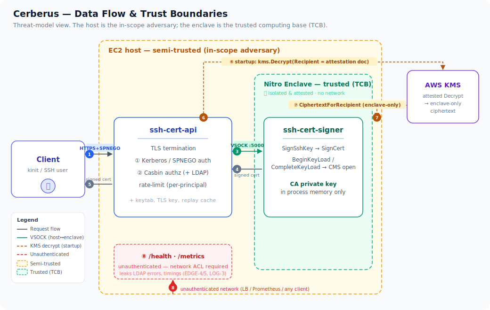

# Cerberus Threat Model

> **Status:** Living document — regenerate when trust boundaries or the threat surface change.
> **Date:** 2026-06-15 · **Scope:** `feature/host-mediated-kms-decrypt` (host-mediated attested KMS decrypt; no KMS proxy).
> **Methodology:** STRIDE per element + DREAD scoring. Findings are grounded in the source with `file:line` evidence.

---

## 1. Purpose & scope

Cerberus is an SSH certificate authority whose CA private key lives only inside an AWS Nitro Enclave. This document
enumerates the threats against that system, the controls already present in the code, the residual risk after those
controls, and the deployment-side prerequisites the design depends on.

**In scope:** the two services (`ssh-cert-api` host gateway, `ssh-cert-signer` enclave), the VSOCK boundary, the
host-mediated KMS decrypt + Nitro attestation chain, Kerberos/SPNEGO authentication, Casbin + LDAP authorization, SSH
certificate issuance, observability, and the build/deploy (EIF/PCR/RPM) supply chain.

**Out of scope:** compromise of the Nitro hypervisor or AWS KMS itself; the Kerberos KDC's own security; `sshd`
configuration on relying hosts (assumed to validate signature, principals, and validity correctly); IAM
privilege-escalation paths on the AWS account.

**Core security goal:** the CA private key is never observable outside the enclave, and certificates are issued only
for principals the authenticated user is authorized for, for a bounded validity window.

## 2. System overview & data flow

**Threat-actor model.** The headline assumption is that **the EC2 host (and the `ssh-cert-api` process) is
semi-trusted** — it may be compromised — while the **enclave is the trusted target**. The host can inject arbitrary
VSOCK frames, holds the EC2 instance-role credentials, and terminates client TLS. The design's job is to keep the CA
key confidential and certificate issuance authorized *even against a compromised host*. Other actors: an
unauthenticated network client (reaches `/health`, `/metrics`, and the TLS/SPNEGO edge); an authenticated user
attempting privilege escalation or abuse; an on-path attacker; and a supply-chain attacker against the build/EIF
pipeline.

## 3. Trust boundaries

- Internet/LAN client → HTTPS TLS termination on EC2 host
- TLS session → Kerberos AP-REQ validation boundary (keytab in process memory)
- Unauthenticated path (`/health`, `/metrics`) → authenticated path (`/sign`)
- HTTP request body → JSON deserialization → authz/enclave dispatch
- Kerberos authentication layer → Casbin authorizer: the authenticated principal string crosses this boundary
- LDAP wire (`ldaps://` / `ldap://`) → LDAP client: the directory server is an external trust partner whose responses drive group-membership decisions
- `config.yaml` operator input → `config.Validate()`: all group and LDAP policy originates from a static operator-written file
- Positive cache layer → authorization decision: singleflight-collapsed results bypass the live directory for up to 10 minutes
- Static-group path vs LDAP-group path: a single resolver error collapses both paths for any principal whose realm is covered by an LDAP backend
- EC2 host process (`ssh-cert-api`) — semi-trusted, capable of injecting arbitrary VSOCK frames
- Nitro Enclave process (`ssh-cert-signer`) — fully-trusted target, holds the CA private key in memory
- VSOCK transport — CID 3 (parent) → CID 16 (enclave) on port 5000; not encrypted, no transport-layer mutual auth
- `BeginKeyLoad`/`CompleteKeyLoad` handshake — host performs `kms:Decrypt` on behalf of the enclave; `CiphertextForRecipient` crosses VSOCK into the enclave
- KMS API boundary — host holds EC2 instance-role credentials and calls `kms.Decrypt`; the KMS key policy is the enforcement point for PCR conditions
- `/dev/nsm` device boundary — root of attestation trust; its availability drives the production-vs-dev code path
- EIF image boundary — PCR0 measures the entire enclave image (incl. any baked-in `CA_PUBLIC_KEY_PATH` pin); a compromised build changes PCR0
- SSH certificate consumer boundary — `sshd` on target hosts verifies signature + `ValidPrincipals` + `ValidBefore`/`ValidAfter` + extensions/critical-options against `TrustedUserCAKeys`
- Host process → log sink (stderr / aggregator) and → unauthenticated `/metrics`
- Enclave error strings → host → HTTP response/log
- User-controlled input (principal names, SSH key comments, Kerberos error text) → structured log fields
- Developer workstation → Git → GitHub Actions CI → base-image registry (build-chain trust)
- EIF build host → KMS (`ca_key.enc` encryption); RPM channel → operator host (package integrity)
- EC2 host OS → `nitro-cli` → Nitro hypervisor (enclave launch integrity); EC2 instance role → AWS KMS

## 4. Assets

- CA RSA private key — lives only in enclave memory as an `ssh.Signer` after load
- KMS-encrypted CA key ciphertext (`ca_key.enc`, baked into the EIF, read on startup)
- NSM attestation RSA-2048 ephemeral keypair (per-boot; decrypts the CMS envelope)
- `CiphertextForRecipient` (CMS envelope relayed over VSOCK; only the enclave's attestation key opens it)
- EC2 instance-role IAM credentials (held by host; used to call `kms.Decrypt`)
- KMS CMK and its key policy (AWS-side control over who can decrypt the CA key)
- PCR0/PCR1/PCR2 measurements (commitment to the exact enclave image; pinned by the KMS policy)
- `CA_PUBLIC_KEY_PATH` pin (opt-in defense against ciphertext substitution; measured into PCR0 when present)
- Issued SSH certificates — privilege-bearing artifacts; `ValidPrincipals`, validity window, extensions, critical-options
- Certificate `KeyId` (Kerberos principal; audit/revocation), serial number, and nonce
- Kerberos keytab file on disk and in process memory (`ssh-cert-api/internal/auth/kerberos.go:53–81`)
- TLS private key on disk (`cmd/ssh-cert-api/main.go`)
- In-process SPNEGO replay cache (gokrb5 singleton)
- Authenticated principal identity string used as the authorization subject
- Casbin in-memory policy and `CertificateRules` returned by the matched group
- LDAP group-membership cache (positive-only, ≤10-min TTL) and LDAP bind credentials
- Nitro Enclave VSOCK connection budget (`maxConcurrentConnections = 32`) and host HTTP fd/goroutine budget
- Startup availability window (CA key must load before `/sign` is useful)
- `/metrics` (request rates, Go build metadata, timing) and `/health` (LDAP backend names, error strings) observability plane
- Supply chain: GitHub Actions workflow, `pkilar/nitro-enclaves-sdk-go` fork (CMS parser on the decrypt path), `govulncheck`/`gosec` binaries, `amazonlinux` base image, RPM packages, `pcr-manifest-{arch}.json`

## 5. Methodology & severity bands

Each threat is classified by **STRIDE** (Spoofing, Tampering, Repudiation, Information disclosure, Denial of service,
Elevation of privilege) and scored with **DREAD** (Damage, Reproducibility, Exploitability, Affected users,
Discoverability; each 1–10, severity = mean):

| Severity | DREAD | Action horizon |
|---|---|---|
| **Critical** | 8.0–10 | Immediate — fix/verify before deploy |
| **High** | 6.0–7.9 | Current cycle |
| **Medium** | 4.0–5.9 | Next cycle |
| **Low** | 1.0–3.9 | Opportunistic |

ID prefixes map to domains: **EDGE** = TLS/Kerberos edge · **AUTHZ** = Casbin/LDAP authorization ·
**DOS** = availability · **VSOCK** = host↔enclave wire · **KMS** = CA-key/KMS/attestation · **SIGN** = certificate
issuance · **LOG** = logging/secrets · **SC** = supply chain/deploy.

## 6. Executive summary

72 threats were identified across 8 trust-boundary domains:

| Severity | Count |
|---|---|
| Critical | 1 |
| High | 28 |
| Medium | 36 |
| Low | 7 |

**The single Critical (`KMS-1`) and its siblings `KMS-2`/`SC-4` are not code defects — they are the load-bearing
*deployment* control.** Because the change is host-mediated, the host holds the KMS-encrypted CA key *and*
`kms:Decrypt`. The only thing preventing a compromised host from issuing a plain (non-attested) `Decrypt` and reading
the plaintext CA key is the **KMS key policy**, which MUST grant the instance role `Decrypt` *only* under a
`kms:RecipientAttestation:ImageSha384` (PCR0) condition, with **no** unconditioned `Decrypt` and **no** `kms:Encrypt`.
This cannot be enforced in code; `ssh-cert-api` emits a `startup.kms_policy_reminder` and it is documented in
`docs/kms-attestation-policy.md`. **Verifying this policy is the #1 pre-deployment action.**

Recurring **High** themes: (a) the unauthenticated `/health` and `/metrics` endpoints leak operational/LDAP detail and
are a DoS surface (`EDGE-4`, `EDGE-5`, `DOS-3`, `LOG-3`) — mitigated only by a network ACL, another deployment
assumption; (b) availability — slow-loris and enclave 32-connection-slot exhaustion (`EDGE-3`, `DOS-1`, `VSOCK-5`);
(c) the host-as-adversary VSOCK surface, which is well-contained by the strict CMS parser, request-variant rejection,
and the opt-in CA-pubkey pin (`VSOCK-2`/`VSOCK-3`, `KMS-2`/`KMS-5`); (d) LDAP transport security (`AUTHZ-7`) and the
first-alphabetical-group authorization rule (`AUTHZ-1`).

## 7. Threat register (all 72)

| ID | Sev | DREAD | STRIDE | Title |
|---|---|---|---|---|
| `KMS-1` | Critical | 8.4 | IE | Compromised host issues non-attested kms:Decrypt to read plaintext CA key |
| `SIGN-2` | High | 7.8 | TE | Validity-window inflation — validity exceeds MaxValidity via crafted request |
| `SC-4` | High | 7.6 | TE | Host-mediated KMS Decrypt exposes instance role to CA key theft if KMS key policy lacks PCR condition |
| `EDGE-3` | High | 7.2 | D | Slow-loris / slow-header attack exhausting HTTP server goroutines |
| `DOS-3` | High | 7.2 | D | Unauthenticated flood of /health requests consumes host CPU / TLS stack (probe indirection bypass) |
| `VSOCK-5` | High | 7.2 | D | Host exhausts enclave connection semaphore via 32 simultaneous slow-drip VSOCK connections |
| `KMS-4` | High | 7.2 | EI | Dev non-attested path activated in production via REQUIRE_ATTESTATION override or missing /dev/nsm |
| `EDGE-4` | High | 7 | I | Unauthenticated /health endpoint leaking LDAP error strings |
| `EDGE-5` | High | 7 | I | Unauthenticated /metrics exposing sign request rates and enclave timing |
| `AUTHZ-7` | High | 7 | TE | LDAP MitM or rogue server injects group memberships (plaintext ldap:// or InsecureSkipVerify) |
| `AUTHZ-6` | High | 6.8 | D | LDAP outage causes fail-closed denial-of-service for all LDAP-realm users |
| `DOS-1` | High | 6.8 | D | Authenticated principal floods /sign to exhaust the enclave's 32-connection slot budget |
| `VSOCK-2` | High | 6.8 | TE | Multi-variant request smuggling: host sets two Request fields to execute a different handler |
| `SIGN-6` | High | 6.8 | TS | Weak or malformed public key accepted for signing |
| `KMS-2` | High | 6.6 | TE | Ciphertext substitution: host replaces CiphertextBlob with attacker-controlled KMS ciphertext to load rogue CA key |
| `SIGN-1` | High | 6.6 | SE | Forged or over-broad ValidPrincipals via compromised host |
| `EDGE-2` | High | 6.4 | SE | Keytab file compromise enabling full authentication bypass |
| `AUTHZ-1` | High | 6.4 | E | Alphabetical-first group wins: operator naming lets a low-privilege group shadow a high-privilege one |
| `VSOCK-3` | High | 6.4 | TE | Host substitutes arbitrary bytes in CompleteKeyLoad.CiphertextForRecipient to trigger adversarial CMS parser input |
| `VSOCK-8` | High | 6.4 | SE | CERBERUS_SIGNER_ENDPOINT env var redirects host signing calls to an attacker-controlled socket |
| `KMS-5` | High | 6.4 | TI | Adversarial CiphertextForRecipient injected by host to panic or corrupt CMS parser |
| `SIGN-4` | High | 6.4 | TR | Extension key collision between Permissions and CustomAttributes allows ambiguous cert content |
| `EDGE-8` | High | 6.2 | D | Oversized or malformed SPNEGO token causing unbounded parsing work |
| `LOG-3` | High | 6.2 | I | /metrics exposes Go runtime build metadata and request timing without authentication |
| `SC-1` | High | 6.2 | TE | Unpinned amazonlinux:latest base image poisons EIF PCR0 silently |
| `AUTHZ-10` | High | 6 | D | LDAP query timeout stalls /sign hot path through enclave concurrency cap |
| `SIGN-3` | High | 6 | TE | CriticalOptions injection — force-command or source-address overridden by host |
| `SIGN-9` | High | 6 | TS | Flag-only extension value enforcement differs host vs. enclave — non-empty permit-pty value reaching the wire |
| `SC-6` | High | 6 | TI | encrypt-ca-key Makefile target pipes plaintext CA key through shell process substitution |
| `DOS-2` | Medium | 6 | D | Oversized /sign body amplifies host memory consumption before the body cap fires |
| `DOS-5` | Medium | 5.8 | D | Enclave fd exhaustion or OOM triggers accept-loop backoff storm, stalling all signing |
| `VSOCK-4` | Medium | 5.8 | ET | Repeated BeginKeyLoad invocations allow host to atomically swap the live CA signer mid-operation |
| `AUTHZ-5` | Medium | 5.6 | EI | Positive cache poisoning: stale LDAP group membership grants access after directory removal |
| `DOS-4` | Medium | 5.6 | D | Startup key-load hang blocks the service indefinitely (KMS or VSOCK unresponsive) |
| `VSOCK-1` | Medium | 5.6 | TE | Oversized request smuggled past bufio.Scanner cap triggers connection drop instead of structured error |
| `KMS-3` | Medium | 5.6 | SE | Attestation document replay or forgery to bypass PCR binding |
| `KMS-7` | Medium | 5.6 | TR | PCR values stale in KMS policy after EIF rebuild — legitimate enclave locked out; old image can still decrypt |
| `EDGE-1` | Medium | 5.4 | ST | SPNEGO ticket replay within the 5-minute clock-skew window |
| `EDGE-6` | Medium | 5.4 | DE | Unauthenticated /health flood starving enclave connection budget |
| `AUTHZ-12` | Medium | 5.4 | E | Wildcard allowed_principals: literal '*' in cert principal rejected client-side but no server-side guard |
| `DOS-8` | Medium | 5.4 | D | LDAP backend outage causes per-request timeout saturation on /sign for LDAP-backed groups |
| `SIGN-7` | Medium | 5.4 | RI | KeyId field carries Kerberos principal from host — audit log tampering if host is compromised |
| `SIGN-8` | Medium | 5.4 | DE | Signing with an uninitialized CA signer — service unavailability window |
| `LOG-2` | Medium | 5.4 | I | group_allowed_principals logged at Info level on every successful sign |
| `SC-3` | Medium | 5.4 | TI | pkilar/nitro-enclaves-sdk-go fork is single-point-of-trust on the attested decrypt path |
| `SC-8` | Medium | 5.4 | TR | RPM packages are not GPG-signed; no artifact signing pipeline exists |
| `SC-10` | Medium | 5.4 | TI | CA_PUBLIC_KEY_PATH pin is opt-in and defaults to unpinned with a warn-only log |
| `AUTHZ-3` | Medium | 5.2 | ES | LDAP filter injection via Kerberos principal UID component |
| `KMS-6` | Medium | 5.2 | I | CA key plaintext retained in memory after parse — insufficient zeroing |
| `SC-2` | Medium | 5.2 | TE | govulncheck and gosec installed at @latest in CI — build-gating tools can be trojanized |
| `SC-5` | Medium | 5.2 | TR | Arch-less EIF path operator copy step has no integrity verification before enclave launch |
| `SC-7` | Medium | 5.2 | TE | GitHub Actions pinned by semver tag (not SHA) for checkout, setup-go, golangci-lint-action |
| `VSOCK-7` | Medium | 5 | IR | Enclave error strings from CMS/key-parse failures leak implementation details via the wire error field |
| `LOG-1` | Medium | 5 | I | Signed certificate wire representation logged at DEBUG in enclave |
| `SC-9` | Medium | 5 | T | cerberus-signer.service has no systemd security hardening — runs as root, no ProtectSystem |
| `AUTHZ-2` | Medium | 4.8 | ET | LDAP-backed group bypasses static group restriction via DN case manipulation |
| `AUTHZ-8` | Medium | 4.8 | E | Realm routing case-sensitivity: lowercase realm in config silently misroutes principals |
| `SIGN-5` | Medium | 4.6 | TI | Non-namespaced extension key collision with future OpenSSH standard extension |
| `AUTHZ-11` | Medium | 4.4 | R | LDAP authorization source logged but not in the signed cert KeyID, reducing non-repudiation |
| `DOS-6` | Medium | 4.4 | D | HealthMonitor probe goroutine stuck on VSOCK steals one enclave slot permanently |
| `LOG-7` | Medium | 4.2 | I | Kerberos auth.failed logs propagate internal gokrb5 error details |
| `EDGE-7` | Medium | 4 | SR | NegTokenResp continuation token accepted where NegTokenInit is required |
| `EDGE-9` | Medium | 4 | E | TLS 1.2 cipher suite downgrade to CBC-mode suites via misconfiguration |
| `LOG-5` | Medium | 4 | I | attestation.cms.parser_panic log exposes input_len of adversarial CMS envelope |
| `LOG-6` | Medium | 4 | I | Enclave error strings propagate verbatim through VSOCK to host logs |
| `DOS-7` | Low | 3.8 | D | Per-principal rate-limiter map grows unboundedly, leaking memory across a long-lived process |
| `AUTHZ-4` | Low | 3.6 | ES | LDAP fail-open gap: malformed principal reaches static-group check when resolver is nil |
| `AUTHZ-9` | Low | 3.4 | E | Members-static-or-LDAP exclusivity violation allows cross-source union if config validation bypassed |
| `LOG-4` | Low | 3.4 | TR | Log injection via user-controlled principal strings in text log format |
| `VSOCK-6` | Low | 3 | I | Unbounded bufio.NewReader on host response path allows enclave error response to consume host memory |
| `LOG-8` | Low | 2.8 | I | CiphertextForRecipient redaction depends on a nil-check that misses a future zero-length blob |
| `SIGN-10` | Low | 2.4 | TR | Serial number collision — non-unique serials reduce revocation precision |

## 8. Detailed findings — Critical & High

Full write-ups for every Critical and High threat (29 total). Medium/Low findings are tabulated in §9.

### External Edge — HTTPS/TLS Termination and Kerberos/SPNEGO Authentication (ssh-cert-api)

#### `EDGE-3` — Slow-loris / slow-header attack exhausting HTTP server goroutines
**High** · DREAD 7.2 · STRIDE: DenialOfService

- **Attack:** An attacker opens many TCP connections and sends HTTP request headers extremely slowly (one byte per second), never completing the header. Each incomplete connection holds a goroutine, a file descriptor, and TLS state. With no MaxConns limit on the http.Server and no infrastructure-level TCP connection cap, an attacker can exhaust the OS file descriptor limit or goroutine heap, taking down /sign for legitimate users. The unauthenticated /health and /metrics paths are also reachable pre-TLS-handshake completion and provide a lower-cost connection-hold surface.
- **Existing controls:** ReadHeaderTimeout: 5 * time.Second is set on the http.Server (main.go:195), which closes connections that have not completed their request headers within 5 seconds — directly mitigating the classic slow-loris attack. ReadTimeout: 10 * time.Second caps the total body read time (main.go:196). The comment at main.go:200–201 explicitly names slow-loris: 'ReadHeaderTimeout/ReadTimeout cover slow-loris on the request side'.
- **Residual risk:** No MaxHeaderBytes is configured (Go default is 1 MiB), leaving a modest oversized-header amplification. No per-IP or per-connection-count limit exists in the application layer; a distributed slow-header attack (many sources, each sending one slow connection) is not mitigated at the application layer and requires network-level controls (security groups, WAF, LB connection limits). TLS handshake cost before ReadHeaderTimeout kicks in means a sustained TLS-ClientHello flood can still exhaust CPU.
- **DREAD:** Damage 7 · Reproducibility 7 · Exploitability 6 · Affected 8 · Discoverability 8

#### `EDGE-4` — Unauthenticated /health endpoint leaking LDAP error strings
**High** · DREAD 7 · STRIDE: InformationDisclosure

- **Attack:** The /health endpoint is intentionally unauthenticated (server.go:109) so load balancers and Prometheus can poll it. The JSON body includes the 'ldap' array which carries per-backend 'last_error' strings verbatim from the LDAP client's err.Error() (ldap_health.go:113: 'snap.LastError = err.Error()'). LDAP error messages from go-ldap typically include the server address, port, and LDAP error code (e.g., 'LDAP Result Code 49 "Invalid Credentials": 80090308: LdapErr: DSID-... AcceptSecurityContext error'). An unauthenticated HTTP client on the network can query GET /health repeatedly to learn: LDAP backend names, LDAP server hostnames/ports embedded in error strings, whether authentication credentials for the LDAP bind are correct, and whether the enclave is loaded (via 'signer not loaded' reason).
- **Existing controls:** The LDAP error is scoped to the LDAP client's HealthCheck return value. The enclave health reason string is deliberately generic — 'enclave unreachable', 'signer not loaded', 'health check stale' — and does not include internal addresses (server.go:364–368). Prometheus metric endpoint exposure is documented as needing network-layer ACL protection (CLAUDE.md: 'Protect /metrics at the network layer').
- **Residual risk:** The 'last_error' field in the LDAP backend snapshot is populated verbatim from go-ldap errors, which include internal network addresses and LDAP diagnostic codes. This is visible to any host-network-reachable client without authentication. If the LDAP bind password is wrong (misconfiguration), repeated health probes disclose that fact alongside the target hostname. No sanitization or filtering of LDAP error strings before inclusion in the health response is present.
- **DREAD:** Damage 4 · Reproducibility 10 · Exploitability 9 · Affected 3 · Discoverability 9

#### `EDGE-5` — Unauthenticated /metrics exposing sign request rates and enclave timing
**High** · DREAD 7 · STRIDE: InformationDisclosure

- **Attack:** The Prometheus /metrics endpoint is unauthenticated (server.go:109, 146). It exposes cerberus_sign_requests_total{outcome=...} (a counter per outcome label), cerberus_sign_duration_seconds (histogram with buckets), cerberus_enclave_errors_total, cerberus_enclave_cpu_seconds_total{mode=...}, cerberus_enclave_memory_bytes{type=...}, and cerberus_ldap_cache_hits_total / cerberus_ldap_query_errors_total. An attacker can correlate denied/success ratios to infer active user populations, detect when the enclave is under load or has errors, and use the LDAP cache-miss rate to fingerprint ongoing authentication activity.
- **Existing controls:** The CLAUDE.md explicitly documents this: 'Protect /metrics at the network layer — it leaks request volumes and timing.' The enclave CPU/memory metrics are only populated once a snapshot exists (enclave_metrics.go:169). The sign-duration histogram does not include per-user labels, so individual user timing cannot be extracted from metrics alone.
- **Residual risk:** The exposure is entirely network-control-dependent. If the EC2 security group or host firewall is misconfigured and the port is reachable from untrusted networks, all metric cardinality is available with no authentication. The application has no fallback protection (no auth layer option, no basic-auth wrapper). LDAP metrics (cerberus_ldap_backend_up, cerberus_ldap_query_errors_total) expose backend names and error counts alongside /health, doubling the information available to an unauthenticated observer.
- **DREAD:** Damage 4 · Reproducibility 10 · Exploitability 9 · Affected 5 · Discoverability 7

#### `EDGE-2` — Keytab file compromise enabling full authentication bypass
**High** · DREAD 6.4 · STRIDE: Spoofing, ElevationOfPrivilege

- **Attack:** The keytab contains the long-lived AES session keys for the HTTP service principal. If the keytab is exfiltrated — via a privilege escalation on the host, a misconfigured backup system, a container image that bakes in the keytab, or an operator accidentally setting permissions wider than 0600 — an attacker can forge arbitrary AP-REQ tokens for any client principal in the same Kerberos realm. Since the keytab is loaded once at startup into process memory (kerberos.go:58), an online copy is also subject to /proc/mem reads by a co-located root process. The keytab is never re-read after startup so on-disk permission tightening after the fact does not help.
- **Existing controls:** Startup hard-refusal: checkKeytabPermissions(keytabPath) → CheckSecretFilePerms(path, "keytab") checks mode&0o077 != 0 and fatals if true (auth/secretfile.go:18–19; auth/kerberos.go:54–56). Tests cover 0600, 0400 (pass) and 0640, 0644, 0620 (fail) — kerberos_test.go:85–90. The keytab is loaded once; there is no SIGHUP reload surface that could be triggered remotely (CLAUDE.md: 'Config is loaded once at startup').
- **Residual risk:** The permission check is a startup gate only; it does not guard against post-startup chmod or a backup process that copies the keytab with open permissions. Keytab rotation requires a service restart; there is no zero-downtime rotation path, meaning operators may delay rotation. No HSM or PKCS#11 protection for the keytab — it is stored as a file and loaded into a Go byte slice with no OS-level secret storage.
- **DREAD:** Damage 10 · Reproducibility 5 · Exploitability 4 · Affected 10 · Discoverability 3

#### `EDGE-8` — Oversized or malformed SPNEGO token causing unbounded parsing work
**High** · DREAD 6.2 · STRIDE: DenialOfService

- **Attack:** An unauthenticated attacker (the SPNEGO challenge round trip does not require an Authorization header on the first request) can craft a POST /sign request with an Authorization: Negotiate header carrying a very large (up to the Go default 1 MiB header limit) or deeply-nested ASN.1 SPNEGO token. Each such request causes gokrb5 to parse the full ASN.1 structure before rejecting it. With no per-IP limit and no MaxHeaderBytes configured, an attacker can sustain a high rate of parsing-work requests to increase CPU load. The rate limiter in principalLimiter only applies after successful authentication (ratelimit.go:74–75), so it does not protect the parse path.
- **Existing controls:** ReadHeaderTimeout: 5 * time.Second (main.go:195) bounds how long a header can be sent. Go's net/http default MaxHeaderBytes of 1 MiB limits header size. base64.StdEncoding.DecodeString in kerberos.go:94 is O(n) but bounded by header size. The gokrb5 ASN.1 parsers are not known to have quadratic behavior. auth.failed is logged at Warn for token rejections (server.go:127), providing visibility.
- **Residual risk:** No application-level MaxHeaderBytes override is set. No per-IP connection rate limiting at the application layer. A sustained 1-MiB header flood with concurrent connections is limited only by OS network stack and TLS overhead. TLS handshake cost per connection provides natural back-pressure but also means the attacker must complete TLS before hitting the parse path, raising the attacker's own cost.
- **DREAD:** Damage 5 · Reproducibility 7 · Exploitability 6 · Affected 7 · Discoverability 6

### Authorization — Casbin per-group policy and LDAP-backed RBAC (ssh-cert-api/internal/authz/*, ssh-cert-api/internal/ldap/*)

#### `AUTHZ-7` — LDAP MitM or rogue server injects group memberships (plaintext ldap:// or InsecureSkipVerify)
**High** · DREAD 7 · STRIDE: Tampering, ElevationOfPrivilege

- **Attack:** If an operator configures url: 'ldap://corp-ad.example.com' (plaintext) or tls.insecure_skip_verify: true, an attacker with network access between the API host and the directory server can intercept or forge LDAP SearchResponse messages. A forged response can return any DN in the memberOf attribute, causing the Cerberus authorizer to map the victim user into an LDAP-backed Cerberus group with wider allowed_principals. Since LDAP responses are trusted after EscapeFilter (which only protects the outgoing filter, not incoming data), there is no second line of defence against forged group DNs. The attacker gains the ability to sign SSH certs for any principal allowed by the targeted Cerberus group, including root.
- **Existing controls:** config.go:81-85: InsecureSkipVerify field with warning. config.go:474-479: WarnLDAPInsecureSkipVerify emitted at startup as slog.Warn. config.go:481-485: WarnLDAPPlaintextURL warns on ldap:// against non-loopback. config.go:313-319: buildTLSConfig (ldap/client.go:315-336) loads operator-supplied CA certificate pool (ca_file) enabling cert pinning. TLS 1.2 minimum enforced (client.go:319: `MinVersion: tls.VersionTLS12`). These are warnings, not hard refusals.
- **Residual risk:** High if operator opts into insecure_skip_verify or plaintext ldap://. Low if ldaps:// with ca_file is used. The residual risk is entirely operator-configuration-dependent. There is no runtime enforcement preventing a misconfigured deployment from running indefinitely with TLS disabled — the warnings fire once at startup and thereafter only appear in logs.
- **DREAD:** Damage 9 · Reproducibility 6 · Exploitability 6 · Affected 9 · Discoverability 5

#### `AUTHZ-6` — LDAP outage causes fail-closed denial-of-service for all LDAP-realm users
**High** · DREAD 6.8 · STRIDE: DenialOfService

- **Attack:** When the LDAP resolver is configured and returns an error for a principal's realm (any dial/bind/search failure), casbin.go:157-160 returns Allowed:false and logs 'authz.ldap.error'. This fail-closed behavior is correct for security, but it means that any LDAP outage — including a transient network hiccup, a server restart, or a certificate expiry on the bind credential — immediately stops certificate issuance for all users in that realm. Unlike the static-group path, there is no graceful degradation: the LDAP error takes precedence even if the user also has a static-group entry (TestAuthorize_LDAPErrorFailsClosed, casbin_test.go:542). If the LDAP backend serves the only realm for a team running production on-call, the outage propagates to inability to SSH.
- **Existing controls:** casbin.go:157-160: explicit fail-closed: `if err != nil { return &AuthorizationResult{Allowed: false}, nil }`. casbin_test.go:542-574: TestAuthorize_LDAPErrorFailsClosed verifies static group does NOT open when LDAP errors. ldap_health.go: LDAPHealthMonitor probes every 5s and logs 'ldap.health.degraded'; /health JSON exposes per-backend status so operators can alert. main.go:124-128: startup HealthCheck refuses to start if any backend fails initial probe. ldap/client.go:236-250: searchWithReconnect() retries once on network-class errors (goldap.ErrorNetwork) before surfacing the error.
- **Residual risk:** Medium. The single reconnect retry in searchWithReconnect mitigates brief TCP drops but not sustained outages. The /health advisory signal exists but LDAP health does not flip the top-level status (ldap_health.go:24-26), so a load balancer routing on /health status would not detect LDAP degradation. Operators must configure separate alerting on cerberus_ldap_backend_up or the ldap[].healthy field.
- **DREAD:** Damage 7 · Reproducibility 5 · Exploitability 7 · Affected 8 · Discoverability 7

#### `AUTHZ-1` — Alphabetical-first group wins: operator naming lets a low-privilege group shadow a high-privilege one
**High** · DREAD 6.4 · STRIDE: ElevationOfPrivilege

- **Attack:** An operator (or attacker who can modify config.yaml) creates or renames a group to sort alphabetically before a higher-privilege group that shares a member. For example, if alice@REALM.COM is in both 'aaa-readonly' (allowed_principals: ['ec2-user'], validity: 1h) and 'ops-root' (allowed_principals: ['root'], validity: 8h), the first-alphabetical rule causes Authorize() to match 'aaa-readonly' for a request for 'ec2-user', returning 1h certs with minimal permissions. Conversely, if the attacker can write a group that begins with 'a' and add the victim user to it, and that group has broader allowed_principals (e.g., '*'), the wildcard group wins and the user gains root-equivalent certs. The rule is deterministic but silently applies the narrowest-alphabetically-first match, which can deny expected privilege OR grant unexpected privilege depending on operator group naming.
- **Existing controls:** casbin.go:90 `slices.Sort(groupNames)` + casbin.go:183-184 `slices.Sort(candidates); candidates = slices.Compact(candidates)` make the ordering deterministic and documented. casbin.go:119-124 (comment) explicitly states the invariant. TestAuthorize_DeterministicOrder (casbin_test.go:210) verifies 'alpha-team' beats 'zebra-team'. config.Validate() (config.go:229-275) does not restrict group naming. There is no config-level warning for groups that share a member and whose alphabetical ordering would differ from privilege ordering.
- **Residual risk:** Medium. The rule is by design and documented, but has no operator guard against accidental shadowing. An operator who adds a new group beginning with 'a' that includes existing members can silently change certificate validity/permissions for those users with no warning at startup. The critical_options case is the highest-impact scenario: 'aaa-unrestricted' without source-address beats 'zebra-restricted' with source-address: 10.0.0.0/8, silently dropping the network restriction from issued certs.
- **DREAD:** Damage 8 · Reproducibility 9 · Exploitability 4 · Affected 6 · Discoverability 5

#### `AUTHZ-10` — LDAP query timeout stalls /sign hot path through enclave concurrency cap
**High** · DREAD 6 · STRIDE: DenialOfService

- **Attack:** Each /sign request with an LDAP-realm principal holds the per-backend mutex (ldap/client.go:228: `c.mu.Lock()`) for the duration of the LDAP search round trip, bounded by `conn.SetTimeout(c.backend.Timeout)` (client.go:270). With ldapTimeoutMax = 30s (config.go:95), a backend configured at the maximum timeout and experiencing a slow directory can stall a goroutine for 30s. The reconnect path (searchWithReconnect:240-250) can double this to 60s. With the enclave's 32-concurrent-connection cap and enough LDAP-realm users hitting /sign simultaneously, a slow directory forces all 32 connections into LDAP-wait, blocking non-LDAP users as well (because the bottleneck is the enclave cap, not the LDAP mutex).
- **Existing controls:** config.go:93-95: `ldapTimeoutMax = 30 * time.Second` with validation at config.go:399-400. ldap/client.go:138-147: search request size limit 2 with `EnforceSizeLimit: true` bounds response parsing time. ldap/client.go:196-199: searchTimeLimitSeconds() floors at 1s and converts to server-side TimeLimit. cache.go:63: singleflight collapses concurrent requests for the same UID to one live query, limiting directory load. Default timeout is 5s (config.go:182). The enclave cap is 32 (CLAUDE.md invariant).
- **Residual risk:** Medium. A pathological LDAP backend at 30s timeout could serve as an amplifier for a DoS: an attacker with valid Kerberos credentials for multiple principals can saturate the enclave concurrency cap. The singleflight collapses only same-UID concurrent requests; different UIDs each hold the mutex independently (the mutex is per-backend, not per-UID), so 32 different users in 32 concurrent /sign requests would each independently block.
- **DREAD:** Damage 6 · Reproducibility 5 · Exploitability 5 · Affected 9 · Discoverability 5

### Availability / Denial of Service

#### `DOS-3` — Unauthenticated flood of /health requests consumes host CPU / TLS stack (probe indirection bypass)
**High** · DREAD 7.2 · STRIDE: DenialOfService

- **Attack:** The /health endpoint is explicitly unauthenticated (`server.go:109` bypasses authMiddleware) to permit load-balancer probes. An external attacker (or a misconfigured LB) can send an unbounded stream of GET /health requests. Each request is cheap on the host — it reads an `atomic.Pointer[healthSnapshot]` load (`health.go:105`), serializes a small JSON struct, and returns — but TLS handshake overhead for each new connection is non-trivial. A TLS session-resumption flood at scale can consume CPU without authentication. Critically, because /health never touches VSOCK (`health.go:35-36` comment), the enclave's 32-slot budget is not affected — but host CPU and the TLS session cache may saturate, delaying /sign responses that require new TLS negotiations.
- **Existing controls:** Health handler never opens VSOCK: `health.go:35-37` and CLAUDE.md invariant `'Do not fix perceived staleness by probing on demand — it re-introduces the DoS this avoids'`. Background HealthMonitor probes every 5 s with a 2 s timeout (`health.go:12-22`); /health reads only the atomic cache (`health.go:105`). Staleness detection: `server.go:362` `time.Since(snap.LastChecked) > healthStaleAfter(30s)` reports unhealthy if monitor goroutine stalls. HTTP server `ReadHeaderTimeout:5s` (`cmd/main.go:195`) limits per-connection cost.
- **Residual risk:** No rate limit or authentication is applied to /health; this is documented as intentional. TLS termination cost per new connection is borne by the host for every unauthenticated probe. Connection-level rate limiting must be enforced upstream (LB / iptables / security group). The /metrics endpoint has the same exposure and additionally leaks request volumes and timing data if reachable publicly.
- **DREAD:** Damage 4 · Reproducibility 9 · Exploitability 8 · Affected 7 · Discoverability 8

#### `DOS-1` — Authenticated principal floods /sign to exhaust the enclave's 32-connection slot budget
**High** · DREAD 6.8 · STRIDE: DenialOfService

- **Attack:** A single compromised or rogue Kerberos principal holds a valid TGS ticket and fires concurrent POST /sign requests at the rate-limiter's burst of 10, draining its token bucket quickly but then uses multiple Kerberos principals (e.g., many service accounts in the same realm) to bypass per-principal limiting. Because each concurrent /sign request holds a VSOCK connection for up to 25 s (SignTimeout), 32 simultaneous attackers from different principals can fully occupy the enclave's semaphore (ssh-cert-signer/cmd/ssh-cert-signer/main.go:99 `sem := make(chan struct{}, maxConcurrentConnections)`). Legitimate users then block at the semaphore send (`case sem <- struct{}{}:` line 129) until a slot frees.
- **Existing controls:** Per-principal token-bucket rate limiter: `ratelimit.go:15-17` `defaultRateLimitRPS=5.0, defaultRateLimitBurst=10`; middleware applied at `server.go:144` before the VSOCK call. Enclave-side semaphore hard cap: `main.go:37,99` `maxConcurrentConnections=32; sem := make(chan struct{}, 32)`. Per-request SignTimeout on the host: `server.go:43` `SignTimeout=25*time.Second` propagated via `context.WithTimeout` at `server.go:295`. Enclave per-connection read/write deadlines reset each iteration: `main.go:163` `conn.SetReadDeadline(time.Now().Add(connDeadline))` (5 s) and `main.go:334` `conn.SetWriteDeadline(...)`. HTTP server WriteTimeout backstop: `cmd/main.go:203` `WriteTimeout: api.SignTimeout + 10*time.Second`.
- **Residual risk:** The rate limiter is per-principal, not per-IP or per-realm. An adversary controlling N distinct Kerberos principals (e.g., N compromised service accounts or LDAP-backed identities) can hold up to N concurrent VSOCK connections. With N >= 32, legitimate users are locked out until a slot drains. There is no global concurrency limit on the host side — Go's http.Server will accept as many TLS connections as the OS allows, but they block waiting for a VSOCK slot. No back-pressure signal propagates to the load balancer's health check because /health reads only the cached HealthMonitor snapshot, not live connection depth.
- **DREAD:** Damage 8 · Reproducibility 7 · Exploitability 5 · Affected 9 · Discoverability 5

### Host↔Enclave VSOCK Boundary and Wire Protocol

#### `VSOCK-5` — Host exhausts enclave connection semaphore via 32 simultaneous slow-drip VSOCK connections
**High** · DREAD 7.2 · STRIDE: DenialOfService

- **Attack:** A compromised host opens 32 concurrent VSOCK connections to the enclave (the maxConcurrentConnections limit) and stalls each one by sending a partial JSON line without a trailing newline, or by sending slowly enough to stay within the 5s connDeadline per iteration but never completing. The accept loop blocks at `sem <- struct{}{}` (main.go:129) for any 33rd connection. Because the health monitor (host-side) probes the enclave over VSOCK, the health check connection also blocks, and /health flips to unhealthy after 30s (HealthMonitor stale-snapshot threshold), causing the load balancer to stop routing traffic.
- **Existing controls:** Semaphore of size 32 at main.go:99: `sem := make(chan struct{}, maxConcurrentConnections)`. Per-connection read deadline of connDeadline=5s reset per scan iteration (main.go:163). The 30s vsockRoundTripDeadline on the host side tears down the connection if the enclave never responds. The context.AfterFunc(ctx, func(){ conn.Close() }) at main.go:152 drains connections on shutdown. The host HealthMonitor caches results so a briefly-stalled probe does not immediately affect health status.
- **Residual risk:** A compromised host can stall all 32 semaphore slots for up to 5s each, cycling through them repeatedly as deadlines expire. This creates a window where legitimate sign requests queue behind the semaphore. Because each stalled connection times out at 5s and the goroutine releases its slot, steady-state DoS requires the host to continuously open new connections, which is trivially within host capability. The HealthMonitor 30s staleness check means a persistent DoS is observable within 30s. No protection beyond the deadline exists against a host that controls the TCP/VSOCK layer; this is a semi-trusted threat actor concern. Residual risk: disruption of signing availability without data loss.
- **DREAD:** Damage 4 · Reproducibility 9 · Exploitability 9 · Affected 7 · Discoverability 7

#### `VSOCK-2` — Multi-variant request smuggling: host sets two Request fields to execute a different handler than the one that passed host-side checks
**High** · DREAD 6.8 · STRIDE: Tampering, ElevationOfPrivilege

- **Attack:** A compromised host sends a JSON Request with both 'signSshKey' and 'beginKeyLoad' (or 'completeKeyLoad') fields set. The intent is to pass the host's own authorization path for SignSshKey while actually triggering a key-load handler inside the enclave, or to invoke CompleteKeyLoad without having first received a legitimate attestation document from a BeginKeyLoad round-trip.
- **Existing controls:** processRequest counts non-nil variants at main.go:219-236: `if nVariants > 1 { return createErrorResponse(errors.New("multiple request variants set; expected exactly one")) }`. The comment at main.go:218 explicitly names this as the smuggling defense. All five variant fields (BeginKeyLoad, CompleteKeyLoad, SignSshKey, Ping, GetEnclaveMetrics) are counted.
- **Residual risk:** JSON's last-write-wins semantics for duplicate keys are not addressed in the Go standard library json.Unmarshal (it silently uses the last value for a given key). A host could send `{"signSshKey":{...},"signSshKey":{...}}` but both writes target the same field, so nVariants stays 1. A more subtle attack would send `{"signSshKey":{...},"beginKeyLoad":{}}` — this sets two distinct fields and is correctly caught by the nVariants > 1 check. Residual risk is negligible for JSON-level attacks. The check does not defend against a future Request field added without updating the counter, but that is a code-review/testing concern rather than a runtime vulnerability.
- **DREAD:** Damage 8 · Reproducibility 9 · Exploitability 4 · Affected 8 · Discoverability 5

#### `VSOCK-3` — Host substitutes arbitrary bytes in CompleteKeyLoad.CiphertextForRecipient to trigger adversarial CMS parser input
**High** · DREAD 6.4 · STRIDE: Tampering, ElevationOfPrivilege

- **Attack:** After receiving a legitimate BeginKeyLoadResponse (which carries the enclave's real attestation document and ciphertext blob), the compromised host calls KMS Decrypt but substitutes the ciphertext blob with one it controls (possible only if the CMK grants kms:Encrypt or if it skips KMS and constructs the CMS envelope directly). It then sends the resulting CiphertextForRecipient — or a wholly crafted byte sequence — to CompleteKeyLoad. The enclave's DecryptCMSEnvelope passes this to the BER parser in the nitro-enclaves-sdk-go cms package, which has a documented panic on adversarial input (off-by-one in the multi-byte-tag loop per attestation.go:119-121).
- **Existing controls:** Size cap: `if len(data) > maxCMSEnvelopeBytes { return nil, fmt.Errorf(...) }` at attestation.go:112-113 (maxCMSEnvelopeBytes=65536). Panic recovery with structured log at attestation.go:125-132: `defer func() { if r := recover(); r != nil { slog.Error("attestation.cms.parser_panic", ...) } }()`. The recover converts a parser crash to an error, keeping the enclave alive. Fuzz corpus in attestation_test.go:283-300 (FuzzDecryptCMSEnvelope). The primary ciphertext-substitution defense is the KMS key policy denying kms:Encrypt and requiring PCR0 conditions (docs/kms-attestation-policy.md). Secondary defense: CA_PUBLIC_KEY_PATH pin in handlers/load-key-signer.go:178 `bytes.Equal(pinned.Marshal(), signer.PublicKey().Marshal())`.
- **Residual risk:** If KMS key policy is misconfigured to grant kms:Encrypt (or the host bypasses KMS entirely and crafts raw bytes), the enclave will attempt to parse them. The panic-recover prevents a crash, but a sufficiently malformed envelope causes a controlled decryption failure — the enclave returns an error and the caSigner stays nil (or retains its previous value). If CA_PUBLIC_KEY_PATH is not set (opt-in, only a WARN is logged at handlers/load-key-signer.go:165), a successful substitution would silently load an attacker-controlled CA key. This threat is High when the KMS key policy is misconfigured; Medium in a correctly-deployed system.
- **DREAD:** Damage 10 · Reproducibility 3 · Exploitability 4 · Affected 10 · Discoverability 5

#### `VSOCK-8` — CERBERUS_SIGNER_ENDPOINT env var redirects host signing calls to an attacker-controlled TCP/Unix socket, bypassing the real enclave
**High** · DREAD 6.4 · STRIDE: Spoofing, ElevationOfPrivilege

- **Attack:** If a host-level attacker (or misconfiguration) sets CERBERUS_SIGNER_ENDPOINT=tcp://127.0.0.1:5000, the dialSigner function at endpoint.go:38-71 bypasses vsock.Dial and connects to a local TCP socket. An attacker who can write to the host's environment or systemd unit file can point the API at a fake signer that returns fabricated signed certificates, impersonating the real enclave without needing to break the Nitro isolation boundary. The fake signer can respond to BeginKeyLoad with Loaded:true to skip the KMS handshake entirely, and then sign arbitrary SSH certificates on demand.
- **Existing controls:** The CERBERUS_SIGNER_ENDPOINT override is documented as an operator feature for the usbhsm bridge use case (endpoint.go:17-30). There is no runtime validation that the resolved connection is actually a Nitro Enclave. The real enclave's signing is protected by the fact that only it holds the CA key; a fake signer would need its own CA key to issue convincing certificates, which would only be accepted if a sysadmin also updated the AuthorizedPrincipalsCommand policy — not an enclave-boundary problem. The OS-level protection is that only root/privileged systemd units can set the environment for ssh-cert-api.
- **Residual risk:** An attacker who has achieved host root can trivially redirect signing to a fake signer using this env var. However, host-root access already allows stopping the real enclave, extracting long-lived credentials from the host, and other higher-impact attacks. The env var provides no additional privilege beyond what host root already grants. Residual risk: the attack vector exists but requires host root, which is already the worst-case compromised-host scenario.
- **DREAD:** Damage 8 · Reproducibility 6 · Exploitability 5 · Affected 8 · Discoverability 5

### CA-key lifecycle, KMS, and attestation

#### `KMS-1` — Compromised host issues non-attested kms:Decrypt to read plaintext CA key
**Critical** · DREAD 8.4 · STRIDE: InformationDisclosure, ElevationOfPrivilege

- **Attack:** The host holds EC2 instance-role credentials and the KMS ciphertext blob. A compromised host calls kms.Decrypt(CiphertextBlob) directly WITHOUT a Recipient/attestation document — the same API that decryptDirect() at load-key-signer.go:130 already uses in the dev path. KMS returns the plaintext CA key directly to the host process, bypassing the CMS envelope and the enclave entirely.
- **Existing controls:** DEPLOYMENT only — docs/kms-attestation-policy.md explicitly calls this out: 'The only thing preventing a compromised host from issuing a plain Decrypt (no Recipient) and reading the plaintext CA key is the key policy.' The policy template at docs/kms-attestation-policy.md:43-58 requires a kms:RecipientAttestation:PCR0 condition on the Allow statement. CODE: decryptDirect() at load-key-signer.go:124-137 is only reached when attestProvider == nil && !required (load-key-signer.go:50,68), so it is not reachable on a correctly running production enclave with /dev/nsm present. The attestationRequired() function at load-key-signer.go:188-213 defaults to true when /dev/nsm is present (line 205). However, none of this stops a compromised HOST from making an independent kms.Decrypt call using the instance role credentials that the host already possesses — the code guards are in the enclave, not on the KMS API.
- **Residual risk:** HIGH if the KMS key policy is misconfigured (no PCR condition, or an additional unconditioned Decrypt statement exists). NEAR-ZERO if the key policy has exactly one Allow with the PCR0 condition and no other statement grants the instance role unconditioned Decrypt — then KMS rejects the non-attested call. This is the single most critical deployment gate in the entire system, and it is not code-verifiable at runtime.
- **DREAD:** Damage 10 · Reproducibility 9 · Exploitability 7 · Affected 10 · Discoverability 6

#### `KMS-4` — Dev non-attested path activated in production via REQUIRE_ATTESTATION override or missing /dev/nsm
**High** · DREAD 7.2 · STRIDE: ElevationOfPrivilege, InformationDisclosure

- **Attack:** A compromised host controls the Nitro Enclave launch command (run-enclave.sh / cerberus-signer.service ExecStart). It sets REQUIRE_ATTESTATION=false in the enclave's environment, or runs the signer binary outside an enclave (no /dev/nsm). The enclave falls through to decryptDirect() at load-key-signer.go:78, which calls kms.Decrypt without a Recipient using the signer's own ambient credential chain. On success it loads the CA key without NSM attestation and logs only a warning at line 82 ('CA key decrypted via non-attested KMS Decrypt').
- **Existing controls:** CODE: attestationRequired() at load-key-signer.go:188-213 auto-detects /dev/nsm when REQUIRE_ATTESTATION is unset (line 205, os.Stat('/dev/nsm')). Unrecognized values fail closed at line 211. Empty-string override fails closed at line 202. The warning log at line 82 is visible in structured slog output. DEPLOYMENT: the KMS key policy with a PCR0 condition is the hard stop — even if the signer reaches decryptDirect(), if the key policy requires an attestation document KMS will reject the unconditioned Decrypt. Additionally, running outside an enclave gives the signer real network (and thus reachable KMS), but /dev/nsm is absent, which is detectable. DEPLOYMENT gap: the host controls the enclave launch environment; if it can set REQUIRE_ATTESTATION=false AND the KMS policy lacks the condition, the dev path succeeds silently with only a slog.Warn.
- **Residual risk:** MEDIUM without KMS PCR condition (host sets env var, dev path succeeds). LOW with PCR condition (KMS rejects the non-attested call). HIGH in the early deployment window before the PCR condition is applied. The warning log is the only in-process signal and does not block startup.
- **DREAD:** Damage 9 · Reproducibility 6 · Exploitability 6 · Affected 10 · Discoverability 5

#### `KMS-2` — Ciphertext substitution: host replaces CiphertextBlob with attacker-controlled KMS ciphertext to load rogue CA key
**High** · DREAD 6.6 · STRIDE: Tampering, ElevationOfPrivilege

- **Attack:** A compromised host controls the CiphertextBlob returned from readEncryptedCAKey() via BeginKeyLoad (the host relays the enclave's response, and the file is baked into the EIF, but the host also controls which EIF runs). The host substitutes a different KMS ciphertext — one that encrypts an attacker-controlled CA private key — in the CompleteKeyLoadRequest.CiphertextForRecipient. This requires the CMK to grant kms:Encrypt to the host role, allowing the host to encrypt the rogue key and produce a valid CMS envelope. If CA_PUBLIC_KEY_PATH is unset or not baked into the EIF, the enclave loads the rogue CA key.
- **Existing controls:** CODE (opt-in): parseCASigner() at load-key-signer.go:146-156 calls verifyPinnedCAPublicKey() which compares the decrypted key's public half to the pinned key at CA_PUBLIC_KEY_PATH (load-key-signer.go:178). On mismatch it returns an error at line 179. When unset, it logs 'loadkey.ca_pubkey.unpinned' (line 165) and proceeds. DEPLOYMENT (primary): docs/kms-attestation-policy.md:77 states 'The primary substitution defense is the attestation-conditioned, Decrypt-only key policy above: with no Encrypt grant the attacker cannot craft a substitute ciphertext.' If the CMK is Decrypt-only with no kms:Encrypt for the instance role, the substitution is infeasible without compromising KMS itself.
- **Residual risk:** LOW when KMS policy is Decrypt-only AND CA_PUBLIC_KEY_PATH is pinned in the EIF. MEDIUM if only one of those controls is present. HIGH if neither is in place (unconditioned Encrypt available to host + no public key pin).
- **DREAD:** Damage 10 · Reproducibility 4 · Exploitability 4 · Affected 10 · Discoverability 5

#### `KMS-5` — Adversarial CiphertextForRecipient injected by host to panic or corrupt CMS parser
**High** · DREAD 6.4 · STRIDE: Tampering, InformationDisclosure

- **Attack:** A compromised host sends a crafted byte sequence in CompleteKeyLoadRequest.CiphertextForRecipient (relayed over VSOCK). The CMS BER parser in the nitro-enclaves-sdk-go fork has at least one documented panic on adversarial input (off-by-one bound check in readObject's multi-byte-tag loop, noted in attestation.go:118-124). The host could exploit this to crash the enclave signer process, causing a DoS on key load; or, if the panic path bypasses the defer/recover, to corrupt memory in a way that leads to loading an unintended key or skipping the pin check.
- **Existing controls:** CODE: DecryptCMSEnvelope() at attestation.go:108-138 has a size cap (maxCMSEnvelopeBytes = 64*1024 at line 26) checked at line 112. A recover() deferred at line 125-132 converts any parser panic to an error and logs attestation.cms.parser_panic with input_len — the enclave fails closed instead of crashing. The panic recovery prevents process termination and surfaces the event as a structured log entry. CODE: CompleteKeyLoad() at load-key-signer.go:90-106 checks attestProvider availability first (line 91); nil provider returns error before reaching the parser.
- **Residual risk:** LOW for crash/DoS: the recover() at attestation.go:125 catches the panic and the enclave logs and returns an error, preserving the process. The CA key load fails, leaving caSigner nil, and all subsequent sign requests return 'CA signer is not initialized' (main.go:306). LOW for memory corruption: Go's runtime bounds the impact of a recovered panic; no evidence of exploitable memory corruption beyond a failed parse. Residual: repeated crafted inputs could cause log noise and prevent key loading until a restart.
- **DREAD:** Damage 6 · Reproducibility 7 · Exploitability 5 · Affected 8 · Discoverability 6

### SSH certificate issuance correctness — ssh-cert-signer enclave

#### `SIGN-2` — Validity-window inflation — validity exceeds MaxValidity via crafted request
**High** · DREAD 7.8 · STRIDE: Tampering, ElevationOfPrivilege

- **Attack:** A compromised host submits EnclaveSigningRequest.Validity='9999h', bypassing the config-layer cap (which is enforced only on the host at startup). The enclave would issue a near-permanent cert, massively widening the blast radius of any principal compromise.
- **Existing controls:** The enclave enforces an independent hard cap: validateSigningRequest (sign-public-key.go:169-170) parses the Validity string, then SignPublicKey (sign-public-key.go:79-81) rejects validityDuration > messages.MaxValidity (24h, messages/messages.go:21). Zero/negative durations are rejected at lines 74-76. config.Validate (config/config.go:261-263) also rejects group configs exceeding MaxValidity at startup so misconfigured groups fail fast rather than at runtime.
- **Residual risk:** Validity is hard-capped at 24h in the enclave with no host involvement. The only residual risk is a clock that is grossly skewed on the enclave (no NTP in Nitro enclaves) causing ValidBefore to land further in the future than expected, effectively extending the window by the skew amount. The 300s back-date on ValidAfter (sign-public-key.go:25, 120) mitigates clock-skew clock-out but does not cap clock-skew clock-in. Residual risk is Low.
- **DREAD:** Damage 7 · Reproducibility 9 · Exploitability 9 · Affected 6 · Discoverability 8

#### `SIGN-6` — Weak or malformed public key accepted for signing
**High** · DREAD 6.8 · STRIDE: Tampering, Spoofing

- **Attack:** An attacker submits a public key that is cryptographically too weak (RSA-1024), uses an unsupported algorithm (DSA, raw legacy RSA1), or is structurally malformed to trigger a panic or unexpected code path in ssh.ParseAuthorizedKey. A previously-issued certificate submitted as the public key input would result in a 'cert of a cert' — escalating its trust lifetime if the enclave signed it.
- **Existing controls:** validatePublicKey (sign-public-key.go:217-248): RSA keys below 2048 bits are rejected (lines 229-231, minRSAKeyBits=2048); ECDSA keys are allowlisted to P-256/P-384/P-521 only (lines 237-239); Ed25519 is accepted unconditionally (line 243); any other type falls to the default error branch (line 246). An 8192-bit RSA upper bound is enforced by x/crypto's ssh.ParseAuthorizedKey upstream ('ssh: rsa modulus too large'), documented in the comment at lines 225-228. Re-certification of a cert is blocked because *ssh.Certificate does not implement ssh.CryptoPublicKey, causing the type assertion at line 219 to fail with 'unsupported public key wrapper'; tested in TestSignPublicKey_RejectsCertificateAsKey (sign-public-key_test.go:583-598). Prefix options and trailing data are rejected at lines 60-65.
- **Residual risk:** The allowlist is tightly specified. The principal residual risk is that x/crypto adds a new key type (e.g., sk-ecdsa-sha2-nistp256, FIDO2 security keys) that passes ParseAuthorizedKey but falls through to the default error branch — resulting in an uninformative rejection rather than a signed cert, which is the safe failure mode. No key-weakening residual.
- **DREAD:** Damage 7 · Reproducibility 7 · Exploitability 6 · Affected 7 · Discoverability 7

#### `SIGN-1` — Forged or over-broad ValidPrincipals via compromised host
**High** · DREAD 6.6 · STRIDE: Spoofing, ElevationOfPrivilege

- **Attack:** A compromised ssh-cert-api process sends an EnclaveSigningRequest over VSOCK with ValidPrincipals set to accounts the authenticated Kerberos user was never authorized for (e.g., ['root','deploy'] when only ['deploy'] was permitted). The host controls the VSOCK channel and constructs the EnclaveSigningRequest wholesale; the enclave receives it and signs whatever principals are in the struct.
- **Existing controls:** The enclave-side validateSigningRequest (ssh-cert-signer/internal/handlers/sign-public-key.go:177-198) checks: (1) non-empty slice, (2) len ≤ messages.MaxPrincipals (messages/messages.go:15, cap=100), (3) no empty/whitespace principal (line 192-193), (4) no literal '*' (line 195-196). The host-side handleSignRequest (ssh-cert-api/internal/api/server.go:245-277) authorizes the user via Casbin before constructing the EnclaveSigningRequest, and sends only grantedPrincipals=slices.Compact(slices.Sort(req.Principals)) (lines 275-282), which are exactly the user-requested set that Casbin confirmed. The enclave has no independent view of the Kerberos-to-group mapping; it cannot re-authorize the request.
- **Residual risk:** A fully compromised host process (e.g., supply-chain attack on the binary, or host OS takeover) can send arbitrary principals to the enclave with no further check. The enclave's principal validation only enforces structural properties (non-empty, no wildcard), not policy. This is an accepted architectural residual: the attestation + PCR0 model protects the CA key itself but not the content of signing requests on a compromised host. Residual risk is rated High because the VSOCK channel is the only control plane.
- **DREAD:** Damage 9 · Reproducibility 6 · Exploitability 5 · Affected 9 · Discoverability 4

#### `SIGN-4` — Extension key collision between Permissions and CustomAttributes allows ambiguous cert content
**High** · DREAD 6.4 · STRIDE: Tampering, Repudiation

- **Attack:** If both Permissions and CustomAttributes maps contain the same key, maps.Copy semantics (last write wins) would silently resolve the collision based on iteration order, meaning the signed cert could carry a value the issuer never intended. An attacker who can influence CustomAttributes (via a crafted config or compromised host) could overwrite a permission value.
- **Existing controls:** validateSigningRequest (sign-public-key.go:200-208) explicitly checks every CustomAttributes key against Permissions and returns an error if any key appears in both maps: 'key %q present in both permissions and custom_attributes'. This check is tested in TestSignPublicKey_RejectsPermissionAttributeCollision (sign-public-key_test.go:644-658). The enclave enforces this independently of the host.
- **Residual risk:** The collision check is present and tested at the enclave layer. Residual risk is Low: the check could be bypassed only if Permissions and CustomAttributes are normalized differently before the check vs. after the maps.Copy (e.g., case normalization), which is not the case here. The check uses exact string equality.
- **DREAD:** Damage 6 · Reproducibility 8 · Exploitability 7 · Affected 5 · Discoverability 6

#### `SIGN-3` — CriticalOptions injection — force-command or source-address overridden by host
**High** · DREAD 6 · STRIDE: Tampering, ElevationOfPrivilege

- **Attack:** CriticalOptions are config-driven (config/config.go:103, server.go:286: maps.Clone(result.CertificateRules.CriticalOptions)). A compromised host can send a CriticalOptions map in the EnclaveSigningRequest that omits an operator-intended force-command restriction, or adds source-address with a broader CIDR, or injects an entirely new critical option key not present in the original config. The enclave performs no allowlist check on CriticalOptions keys or values.
- **Existing controls:** config.Validate → validateFlagExtensions (config/config.go:406-418) catches non-empty values on flag-only extensions (permit-pty etc.) at startup. maps.Clone (server.go:286) prevents the runtime config pointer from being mutated. The enclave copies the map directly via maps.Copy(permissions.CriticalOptions, req.CriticalOptions) (sign-public-key.go:108) with no further inspection. There is no enclave-side allowlist for CriticalOptions keys.
- **Residual risk:** A compromised host can suppress force-command or widen source-address in the issued cert. sshd enforces these options only when they are present in the cert; absence of force-command is indistinguishable to sshd from a cert that never had one. The enclave cannot independently re-read the config. Residual risk remains High on a compromised host.
- **DREAD:** Damage 8 · Reproducibility 6 · Exploitability 5 · Affected 7 · Discoverability 4

#### `SIGN-9` — Collision between flag-only extension value enforcement on host vs. enclave — non-empty permit-pty value reaching the wire
**High** · DREAD 6 · STRIDE: Tampering, Spoofing

- **Attack:** config/config.go flagOnlyExtensions enforcement (lines 118-126, 406-418) runs only at config load time on the host. It validates the operator-provided config.yaml but does not validate the runtime EnclaveSigningRequest payload. A compromised host could inject a non-empty value for 'permit-pty' (e.g., 'permit-pty':'some-data') directly into EnclaveSigningRequest.Permissions, bypassing the startup check. sshd would then reject the cert at connect time with 'Certificate option permit-pty corrupt (extra data)', producing a silent per-connection denial.
- **Existing controls:** config/config.go validateFlagExtensions (lines 406-418) rejects non-empty flag values for the seven known flag-only extensions at startup. The enclave's sign-public-key.go maps.Copy (line 106) blindly copies the Permissions map without inspecting individual key-value semantics. There is no enclave-side check for non-empty flag-extension values.
- **Residual risk:** This is a correctness gap rather than a security escalation: the resulting cert fails at sshd connect time (denial of service to the legitimate user), not a privilege escalation. A compromised host could exploit this to deny access to targeted users without leaving an obvious log trail on the enclave (the signing succeeds; the failure surfaces only when the user ssh-es). The host startup check is the only enforcement layer.
- **DREAD:** Damage 4 · Reproducibility 8 · Exploitability 7 · Affected 6 · Discoverability 5

### Logging, Observability, and Secret Exposure

#### `LOG-3` — /metrics exposes Go runtime build metadata and request timing without authentication
**High** · DREAD 6.2 · STRIDE: InformationDisclosure

- **Attack:** The `/metrics` endpoint at ssh-cert-api/internal/api/server.go:146 uses `promhttp.Handler()` against the default Prometheus registry (`prometheus.DefaultRegisterer`). The default registry automatically collects the `go_build_info` metric, which includes the Go toolchain version, the module path (`github.com/pkilar/cerberus/ssh-cert-api`), and the module version string. It also includes `process_open_fds`, `process_resident_memory_bytes`, `go_goroutines`, and `go_memstats_*`. The `cerberus_sign_requests_total{outcome=...}` and `cerberus_sign_duration_seconds` metrics reveal absolute request volumes and latency distribution to any network-reachable client. The auth middleware explicitly exempts `/metrics` (server.go:109: `if r.URL.Path == "/health" || r.URL.Path == "/metrics"`). CLAUDE.md acknowledges this: "Protect /metrics at the network layer — it leaks request volumes and timing." There is no authentication or IP allowlist in the application code itself.
- **Existing controls:** ssh-cert-api/internal/api/server.go:109 explicitly exempts /metrics from Kerberos auth (by design). CLAUDE.md RUNBOOK.md directs operators to protect /metrics at the network layer. The metric labels are deliberately low-cardinality (outcome strings only, no user principals) per the comment at metrics.go:9: "adding labels bumps cardinality across every scrape." LDAP metrics also avoid per-user labels (ldap/metrics.go:19: "high-cardinality dimensions like user principal are deliberately NOT labels").
- **Residual risk:** If the network-layer protection is misconfigured (security group too broad, public subnet), an unauthenticated attacker learns the exact module path (useful for supply-chain targeting), Go toolchain version (CVE targeting), signing throughput patterns (traffic analysis), and enclave CPU/memory utilization. This is a known accepted risk per CLAUDE.md, but the application has no fallback enforcement.
- **DREAD:** Damage 4 · Reproducibility 10 · Exploitability 7 · Affected 2 · Discoverability 8

### Supply chain, build, and deployment provenance

#### `SC-4` — Host-mediated KMS Decrypt exposes instance role to CA key theft if KMS key policy lacks PCR condition
**High** · DREAD 7.6 · STRIDE: Tampering, ElevationOfPrivilege

- **Attack:** The host-mediated BeginKeyLoad/CompleteKeyLoad design (ssh-cert-api/internal/keyload/keyload.go) means the EC2 instance role (via `config.LoadDefaultConfig`, keyload.go:71-76) calls `kms.Decrypt` with the attestation document as Recipient. This is the correct design. However, if the KMS key policy is misconfigured — specifically, if it grants the instance role `kms:Decrypt` without the `kms:RecipientAttestation:PCR0` condition (as shown in docs/kms-attestation-policy.md's Development Mode section) — then a compromised host can call `kms.Decrypt` without a Recipient, receive the CA key in plaintext, and extract it without ever involving the enclave. The instance role credentials are available to any process running as the `cerberus` user (uid on the host) via IMDS at 169.254.169.254.
- **Existing controls:** docs/kms-attestation-policy.md documents a Critical warning about this exact scenario (the block beginning 'Critical — deny non-attested Decrypt'). The warning is explicitly in the production key policy template. ssh-cert-api/cmd/ssh-cert-api/main.go contains an inline operator reminder comment. The cerberus-api.service systemd unit (cerberus-api.service:9) runs under `User=cerberus Group=cerberus` with `NoNewPrivileges=yes`, `ProtectSystem=strict`, and `ProtectHome=yes`, limiting which processes can reach IMDS. There is no `NoNewPrivileges=yes` or User= directive on cerberus-signer.service — the signer service runs nitro-cli as root (cerberus-signer.service has no User= line).
- **Residual risk:** The PCR condition in the KMS policy is entirely operator-configured. There is no startup check in the host code that verifies the key policy requires attestation before proceeding. An operator who follows the Development Mode instructions (no PCR condition) and forgets to harden before production leaves the CA key fully exposed to any process that can call KMS with the instance role. The cerberus-signer.service has no systemd security hardening directives at all, and it runs as root (required for nitro-cli), meaning any escape from the EIF launch sequence would have full instance role access.
- **DREAD:** Damage 10 · Reproducibility 7 · Exploitability 5 · Affected 10 · Discoverability 6

#### `SC-1` — Unpinned amazonlinux:latest base image poisons EIF PCR0 silently
**High** · DREAD 6.2 · STRIDE: Tampering, ElevationOfPrivilege

- **Attack:** An attacker who can influence the Amazon Linux container registry (supply chain compromise, tag mutation, or DNS/BGP hijack of public.ecr.aws) pushes a backdoored image under the amazonlinux:latest tag. The next `make eif-amd64` pulls that image, builds the EIF, computes a new PCR0, and emits a new pcr-manifest-amd64.json. If the operator applies the new PCR0 to the KMS key policy (the documented workflow), the compromised rootfs passes attestation and can intercept the CA plaintext key at CompleteKeyLoad time. The docker build layer cache may also cause the bad layer to persist across rebuilds.
- **Existing controls:** ssh-cert-signer/Dockerfile:3 uses `FROM amazonlinux:latest` with no digest pin. The Makefile (ssh-cert-signer/Makefile:45-49) does emit a PCR manifest after each build, and docs/kms-attestation-policy.md documents that PCR0 must be updated in the KMS policy, so an operator who compares old vs. new PCR0 before updating the policy would notice an unexpected change. The .gitignore (root:.gitignore:26-27) excludes EIF and PCR manifests from source control, preventing stale manifests from being confused for current ones.
- **Residual risk:** No digest pin in the Dockerfile means every EIF rebuild may silently pick up a different rootfs. The PCR0 change is detectable only if the operator compares manifests before updating the KMS policy — there is no automated gate that flags a PCR0 change caused by an upstream image update vs. intentional code changes. A build system with no image provenance verification (no cosign/sigstore check in the Makefile or CI) cannot distinguish legitimate from compromised base images.
- **DREAD:** Damage 9 · Reproducibility 5 · Exploitability 4 · Affected 9 · Discoverability 4

#### `SC-6` — encrypt-ca-key Makefile target generates RSA-4096 key and pipes plaintext through shell process substitution
**High** · DREAD 6 · STRIDE: Tampering, InformationDisclosure

- **Attack:** The `make encrypt-ca-key` target (ssh-cert-signer/Makefile:82-95) runs `ssh-keygen -t rsa -b 4096 -f ca_key -N ""` which writes the plaintext private key to disk (ca_key file in the working directory), then pipes it to `aws kms encrypt --plaintext fileb://ca_key`, then `rm -f ca_key`. During the window between key generation and deletion, the plaintext key exists as a regular file. If the build host's filesystem is accessible to other processes (shared CI runner, container with mounted volumes, or an attacker with concurrent read access), the plaintext can be stolen. Additionally, `rm -f` is not a secure delete on SSDs or network filesystems; the key material may persist in unallocated blocks. The RUNBOOK.md (rotation section) documents using `shred -u ca_key` as the correct deletion method, but the Makefile uses plain `rm -f`.
- **Existing controls:** root .gitignore:33 (`ca_key.*`) excludes all ca_key variants from git tracking, preventing accidental commit of the plaintext key. RUNBOOK.md documents the rotation workflow with `shred -u ca_key` (not `rm -f`). The key generation is intended as a one-time operator procedure run on a trusted host, not in CI. The EIF bakes the encrypted ca_key.enc, not the plaintext.
- **Residual risk:** The Makefile uses `rm -f` not `shred`. On SSDs with wear leveling, deleted file contents may be recoverable from free blocks. The target is intended for operator use on a secure workstation, but the discrepancy between the Makefile (`rm -f`) and RUNBOOK.md (`shred -u`) creates a documentation-vs-implementation gap that an operator following the Makefile path would miss. No tmpfs/ramfs is used for key generation.
- **DREAD:** Damage 9 · Reproducibility 4 · Exploitability 3 · Affected 9 · Discoverability 5

## 9. Medium & Low findings

| ID | Sev | DREAD | STRIDE | Title | Existing control (summary) |
|---|---|---|---|---|---|
| `DOS-2` | Medium | 6 | D | Oversized /sign body amplifies host memory before the body cap fires | Hard body cap `server.go:34,166` `maxSignRequestBytes=64*1024` via `http.MaxBytesReader`; typed 413 on overflow |
| `DOS-5` | Medium | 5.8 | D | Enclave fd exhaustion/OOM triggers accept-loop backoff storm | Semaphore cap 32 `main.go:99,129`; capped accept backoff `main.go:50-53,112` |
| `VSOCK-4` | Medium | 5.8 | ET | Repeated BeginKeyLoad lets host atomically swap the live CA signer | KMS PCR0 policy is the runtime gate; `caSigner` is an `atomic.Pointer` swapped only via the load handlers |
| `AUTHZ-5` | Medium | 5.6 | EI | Positive cache poisoning: stale LDAP membership after directory removal | `ldapCacheTTLMax=10m` hard cap `config.go:88-91,393-394`; positive-only, errors never cached |
| `DOS-4` | Medium | 5.6 | D | Startup key-load hang blocks the service indefinitely | 60s startup timeout `cmd/main.go:90`; fatal on failure `cmd/main.go:97-9x` |
| `VSOCK-1` | Medium | 5.6 | TE | Oversized request past scanner cap drops connection vs structured error | `scanner.Buffer(...,maxRequestBytes=262144)` `main.go:157`; oversize → structured "request exceeds" error |
| `KMS-3` | Medium | 5.6 | SE | Attestation document replay or forgery to bypass PCR binding | Fresh RSA-2048 per process `attestation.go:46-54`; NSM-signed doc embeds the ephemeral pubkey; KMS validates the cert chain |
| `KMS-7` | Medium | 5.6 | TR | Stale PCR in policy locks out new EIF / old image still decrypts | Update procedure `docs/kms-attestation-policy.md:99-116`; `pcr-manifest-{arch}.json` is source of truth |
| `EDGE-1` | Medium | 5.4 | ST | SPNEGO ticket replay within the 5-minute clock-skew window | gokrb5 `IsReplay()` per-principal in-memory cache `service/APExchange.go:25-28`; GC'd at `MaxClockSkew` |
| `EDGE-6` | Medium | 5.4 | DE | Unauthenticated /health flood starving enclave connection budget | `/health` reads only the cached snapshot (`health.go:99`); never opens VSOCK on the request path |
| `AUTHZ-12` | Medium | 5.4 | E | Literal '*' principal rejected client-side but no server-side guard | Explicit `if p=="*"` 400 check `server.go:232-237`; cert issued for exact requested principals only |
| `DOS-8` | Medium | 5.4 | D | LDAP outage → per-request timeout saturation on /sign | Positive TTL cache + singleflight collapse `cache.go:56-83`; bounded per-backend timeout |
| `SIGN-7` | Medium | 5.4 | RI | KeyId carries host-supplied principal — audit tampering if host compromised | Non-empty KeyId enforced `sign-public-key.go:159-162`; `sign.cert_issued` audit event |
| `SIGN-8` | Medium | 5.4 | DE | Signing with an uninitialized CA signer — availability window | `handleSignSshKey` returns error (not panic) on nil `caSigner` `main.go:303-318`; double-checked in `SignPublicKey` |
| `LOG-2` | Medium | 5.4 | I | group_allowed_principals logged at Info on every successful sign | Intentional audit field `server.go:309` (CLAUDE.md-documented) so operators can audit dynamic group assignment |
| `SC-3` | Medium | 5.4 | TI | pkilar/nitro-enclaves-sdk-go fork is single-point-of-trust on the decrypt path | Exact-hash pin in `ssh-cert-signer/go.sum` (`v1.1.0 h1:...`); fuzz coverage on the CMS path |
| `SC-8` | Medium | 5.4 | TR | RPM packages are not GPG-signed; no artifact signing pipeline | Files installed at fixed modes (`cerberus.spec:110-111`); no `%gpg_sign` — relies on a trusted distribution channel |
| `SC-10` | Medium | 5.4 | TI | CA_PUBLIC_KEY_PATH pin is opt-in, defaults to unpinned warn-only | `loadkey.ca_pubkey.unpinned` WARN `load-key-signer.go:164-166` makes the missing pin visible; documented |
| `AUTHZ-3` | Medium | 5.2 | ES | LDAP filter injection via Kerberos principal UID | `ldap.EscapeFilter(shortUID)` (RFC 4515) `filter.go:47`; `ValidFilterTemplate` checks at config load |
| `KMS-6` | Medium | 5.2 | I | CA key plaintext retained in memory after parse — incomplete zeroing | `defer clear(plaintextKey)` `load-key-signer.go:99`; same in `decryptDirect`; Go strings immutable so SDK copies may linger |
| `SC-2` | Medium | 5.2 | TE | govulncheck/gosec at @latest in CI — gating tools trojanizable | golangci-lint pinned `golangci/golangci-lint-action@v9` (`version: v2.12.2`); Dependabot tracks updates |
| `SC-5` | Medium | 5.2 | TR | Arch-less EIF copy step has no integrity verification pre-launch | `run-enclave.sh:25-28` checks the EIF exists but verifies no hash/signature before launch |
| `SC-7` | Medium | 5.2 | TE | GitHub Actions pinned by semver tag, not SHA | Action versions pinned by tag (`v9`, `version: v2.12.2`); not commit-SHA-pinned |
| `VSOCK-7` | Medium | 5 | IR | Enclave error strings leak implementation detail via the wire error field | `RedactedJSON`/`RedactedResponseJSON` `messages.go:168-196` elide blobs; error strings are descriptive, not key material |
| `LOG-1` | Medium | 5 | I | Signed certificate wire representation logged at DEBUG in enclave | Gated by `DEBUG=true` (`logging.go:65`); off by default; the cert is a public artifact |
| `SC-9` | Medium | 5 | T | cerberus-signer.service has no systemd hardening — runs as root | sysconfig mode 0640 root:root (`cerberus.spec:175`); root required by nitro-cli; no `ProtectSystem`/`NoNewPrivileges` |
| `AUTHZ-2` | Medium | 4.8 | ET | LDAP-backed group bypasses static restriction via DN case manipulation | `normalizeDN()` `casbin.go:215-223` with documented RFC4514 approximation caveat |
| `AUTHZ-8` | Medium | 4.8 | E | Lowercase realm in config silently misroutes principals | `WarnLDAPRealmLowercase` `config.go:502-509`; empty/whitespace realm rejected |
| `SIGN-5` | Medium | 4.6 | TI | Non-namespaced extension key collision with future OpenSSH extension | `config.Warnings()` `config.go:458-526` emits `WarnStaticAttributeNotNamespaced` (PROTOCOL.certkeys §4) |
| `AUTHZ-11` | Medium | 4.4 | R | LDAP authz source logged but not in the signed cert KeyID | `authz_source` recorded in `sign.success` log `server.go:313`; not embedded in the cert itself |
| `DOS-6` | Medium | 4.4 | D | HealthMonitor probe stuck on VSOCK steals one enclave slot | 2s probe timeout `health.go:81-82` with cancel-on-context teardown |
| `LOG-7` | Medium | 4.2 | I | Kerberos auth.failed logs propagate gokrb5 error detail | Explicit guard never logs token bytes `kerberos.go:99-101` (even truncated) |
| `EDGE-7` | Medium | 4 | SR | NegTokenResp accepted where NegTokenInit required | `parseSPNEGOAPReq` checks `st.Init`, returns `errNotNegTokenInit` `kerberos.go:156-157` |
| `EDGE-9` | Medium | 4 | E | TLS 1.2 CBC-mode downgrade via misconfiguration | `MinVersion: TLS12` + AEAD-only `CipherSuites` hard-coded `main.go:209-219` |
| `LOG-5` | Medium | 4 | I | parser_panic log exposes input_len of adversarial CMS envelope | Raw bytes never logged; only `"input_len"` count `attestation.go:127-130` |
| `LOG-6` | Medium | 4 | I | Enclave error strings propagate verbatim to host logs | HTTP client receives only generic "Signing failed" `server.go:304`; raw enclave error not forwarded to caller |
| `DOS-7` | Low | 3.8 | D | Per-principal rate-limiter map grows unboundedly | Documented intentional no-eviction `ratelimit.go:22-23`; footprint O(unique Kerberos principals) |
| `AUTHZ-4` | Low | 3.6 | ES | Malformed principal reaches static-group check when resolver is nil | `errMalformedPrincipal` fail-closed when resolver≠nil `ldap_resolver.go:42-47`; static path explicit |
| `AUTHZ-9` | Low | 3.4 | E | Static-or-LDAP exclusivity violation allows cross-source union | Hard error at `LoadConfig` if both set `config.go:230-234` |
| `LOG-4` | Low | 3.4 | TR | Log injection via user-controlled principal strings (text format) | `LOG_FORMAT=json` (recommended) escapes control chars; stdlib slog handlers quote attribute values |
| `VSOCK-6` | Low | 3 | I | Unbounded host response reader can consume host memory | 30s wall-clock `conn.SetDeadline` `client.go:90` bounds the read window |
| `LOG-8` | Low | 2.8 | I | Redaction nil-check could miss a future zero-length blob | Explicit redaction before marshalling `messages.go:159-196`; current types always populate the blob when present |
| `SIGN-10` | Low | 2.4 | TR | Serial collision reduces revocation precision | Serial from `crypto/rand` over 2^64 `sign-public-key.go:91`; collision probability negligible |

## 10. Control posture — code-enforced vs deployment-enforced

Cerberus pushes several load-bearing controls to the deployment layer. This table separates what the code guarantees
from what the operator MUST provide; the deployment column is where most residual risk concentrates.

| Control | Enforced in code | Operator-enforced (deployment) | Threats |
|---|---|---|---|
| CA-key confidentiality vs. compromised host | Response bound to enclave attestation key (`CiphertextForRecipient`) | **KMS key policy: attestation-conditioned, Decrypt-only, no unconditioned Decrypt, no Encrypt** | KMS-1, KMS-2, SC-4 |
| Which enclave image may decrypt | Attestation doc carries PCR measurements | **PCR0 pinned in KMS policy; refreshed on every EIF rebuild** | KMS-3, KMS-7, SC-1, SC-5 |
| Ciphertext substitution | Opt-in CA-pubkey pin (`CA_PUBLIC_KEY_PATH`); refuses on mismatch | Bake `ca_key.pub` into the EIF + set the env var (opt-in); Decrypt-only policy is the primary control | KMS-2, SC-10 |
| `/metrics` & `/health` exposure | Unauthenticated by design | **Network ACL restricting to LB/Prometheus** | EDGE-4, EDGE-5, DOS-3, LOG-3 |
| Replay protection | In-process gokrb5 replay cache | NTP sync within the clock-skew window; minimize restarts | EDGE-1 |
| Keytab / TLS key secrecy | Startup permission check (0600/0400) | Filesystem perms after startup; rotation requires restart | EDGE-2 |
| LDAP integrity | TLS-capable client; fail-closed | **`ldaps://` + verified TLS (no `InsecureSkipVerify`)** | AUTHZ-7 |
| Enclave launch integrity | — | Trusted EIF build host; SHA-pinned base image; `REQUIRE_ATTESTATION` set | SC-1, KMS-4 |
| Host process privilege | — | systemd hardening (root required by nitro-cli) | SC-9 |

## 11. Recommendations & roadmap

**P0 — before/at deploy (gates go-live):**
1. **Verify the KMS key policy** grants the instance role `Decrypt` only under `kms:RecipientAttestation:ImageSha384`
   (PCR0), with no unconditioned `Decrypt` and no `kms:Encrypt` (`KMS-1`, `KMS-2`, `SC-4`). This is the single most
   important control and is not code-enforceable.
2. **Network-restrict `/metrics` and `/health`** to the LB/Prometheus subnet (`EDGE-4`, `EDGE-5`, `DOS-3`, `LOG-3`).
3. **Confirm PCR0 in the policy matches the deployed EIF** (`pcr-manifest-<arch>.json`) and that `REQUIRE_ATTESTATION`
   is not forced off (`KMS-4`, `KMS-7`).
4. **Enforce `ldaps://` with verified TLS** for every LDAP backend; reject `InsecureSkipVerify` (`AUTHZ-7`).

**P1 — current cycle (code/config hardening):**
- Set an HTTP `MaxHeaderBytes`/connection cap or front with a WAF/LB connection limit for slow-loris and `/health`
  floods (`EDGE-3`, `DOS-3`, `EDGE-6`).
- Add systemd hardening to the service units (`ProtectSystem`, `NoNewPrivileges`, drop capabilities where nitro-cli
  permits) (`SC-9`).
- SHA-pin the Docker base image and GitHub Actions; pin `govulncheck`/`gosec` versions in CI (`SC-1`, `SC-7`, `SC-2`).
- Document/operationalize the SPNEGO replay window across restarts; consider a shared replay cache if restart cadence
  is high (`EDGE-1`).
- Lint group names to prevent alphabetical-first-group shadowing (`AUTHZ-1`); audit validity-cap and critical-option
  enforcement end-to-end (`SIGN-2`, `SIGN-3`).

**P2 — opportunistic:**
- Bound the per-principal rate-limiter map / add eviction (`DOS-7`).
- Reduce verbatim LDAP error text in the `/health` JSON body (`EDGE-4`).
- Bound the host-side response reader (`VSOCK-6`); revisit the redaction nil-check edge (`LOG-8`).

## Appendix A — Assumptions & prerequisites

These are the trust assumptions the analysis depends on. Several (KMS policy, `/metrics` ACL, NTP, EIF provenance) are
load-bearing — see §10.

- The Nitro Enclave itself is not compromised; the threat actor is the EC2 host OS and the `ssh-cert-api` process.
- **The KMS key policy enforces `kms:RecipientAttestation` (PCR0) conditions so a non-attested `Decrypt` by the host is denied** — a documented prerequisite (`docs/kms-attestation-policy.md`), an operator responsibility, not code-enforced.
- The EC2 instance role has `kms:Decrypt` but **not** `kms:Encrypt` on the CA CMK; without `kms:Encrypt` a compromised host cannot craft an alternative ciphertext (bounds `KMS-2`).
- `CA_PUBLIC_KEY_PATH` is opt-in; absent it, only the KMS key policy prevents ciphertext substitution.
- The enclave binary/deps are compiled into a PCR0-measured EIF; code inside the enclave is trusted; the EIF is rebuilt and PCR values updated in the policy after every deployment.
- `REQUIRE_ATTESTATION` is set by the (trusted) `run-enclave` command; a host that controls the launch command controls this flag (`KMS-4`).
- VSOCK (CID 3→16, port 5000) is reachable only from the parent EC2 instance; no external path dials the enclave directly.
- Kerberos auth, Casbin authz, and principal→group mapping all run on the host; the enclave trusts the host performed them. `config.yaml` is operator-controlled and not user-writable; config is loaded once (no SIGHUP reload).
- The LDAP directory is operated by a trusted party; responses are trusted after TLS verification. LDAP health failures are advisory in `/health` but **fail-closed** on the `/sign` hot path.
- `sshd` on targets is configured with `TrustedUserCAKeys` and validates signature, `ValidPrincipals`, and `ValidBefore`/`ValidAfter`. No CRL/OCSP is in scope; short validity (≤24h `MaxValidity`) is the revocation strategy.
- No mutual TLS; client auth is solely Kerberos SPNEGO. The TLS server cert is issued by a CA clients trust. NTP keeps the KDC, clients, and API host within the 5-minute clock-skew window.
- The keytab path is operator-supplied; no world-readable default. The host has network access to configured LDAP servers and KMS.
- `/metrics` is network-protected at the LB/host-firewall layer (CLAUDE.md invariant). `DEBUG=true` is not set in production; `LOG_FORMAT=json` is used. The log aggregator is a trusted internal system.
- The EIF build runs on a trusted operator workstation (not CI; CI lacks `nitro-cli` and `ca_key.enc`). The `hf/nsm` and `pkilar/nitro-enclaves-sdk-go` dependencies are pinned by `go.sum` hash. GitHub Actions runners are ephemeral and not cross-tenant. RPM distribution is over an operator-controlled channel. `cerberus-signer.service` runs as root because nitro-cli requires it.

---

*Generated from an 8-domain parallel STRIDE/DREAD analysis grounded in the source tree. Re-run the analysis and
regenerate this document when the architecture or trust boundaries change.*
